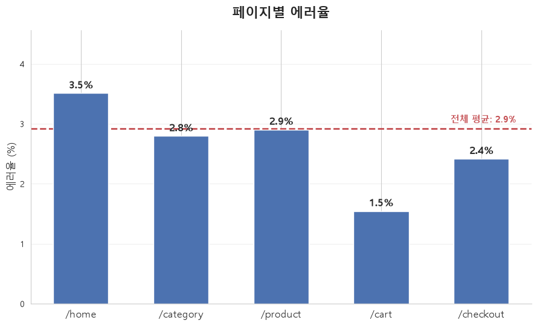

# 모두마켓 웹 접속 로그 — EDA & 시각화 보고서 🎯

## 🚀 1. 데이터 개요
- 행/열: (2502행, 7열)
- 주요 컬럼: log_id, session_id, response_time_ms, request_path, device, hour, is_error

## 📝 2. 결측 진단 (missingno)
- `response_time_ms` 결측 비율: 4.8 %
- 결측 패턴: matrix로 결측 시간대를 확인해 본 결과 0시 ~ 2시사이에 결측이 많이 분포되어 있는것을 확인할 수 있었다.
- 의심 가설: 심야 시간대에 점검으로 인한 응답 오류가 의심된다

## 🛡️ 3. 정제와 검증 (전·후 분포 비교)
- 적용한 정제: 중복 제거 / device 표기 통일 / hour 이상치 / response_time_ms 결측 대체(분포가 심야 시간대에 몰려있으므로 평균대신 중앙값사용) / 극단치 클리핑
- KDE 비교 결과: 분포가 겹쳐진 모습이 유사하고 정규분포에 가까운 형태가 되었다.
- device 정제 전 칼럼: mobile(33.7%), desktop(20.9%), MOBILE(20.0%), Mobile(15.1%), DESKTOP(10.3%)
- device 정제 후 칼럼: mobile(68.8%), desktop(31.2%)

## 📄 4. 탐색에서 도출한 새 질문
- 응답시간, 에러율, 디바이스별 추가적인 상관관계가 있을까?
- 디바이스 별 응답률을 체크, 또 그 응답률이 의미가 있는 데이터일까?
- 각 경로별 에러 발생률이 가장 높은 경로는 어디일까? 
- 의미있는 데이터처럼 보이지만 좀 더 자세히 살펴보기 위해서는 어떤 통계적 검정을 추가로 진행해야 할까?
- 어느 시간대에 응답 에러가 많이 발생했는지 어떻게 확인해야 할까? 또 전체 에러율이 4.8%에 불과한데 이게 페이지별 응답률을 찾아도 의미가 있을까?

## 📊 5. 전달용 차트 1개 (이미지 또는 코드 인용)
- 
- 페이지별 에러율에는 큰 차이가 존재하지 않고 앞서 확인한 상관관게에서도 각 변수들이 서로 독립적이라는것을 확인함

## 🗂️ 6. 다음 분석 제안
- 에러의 원인 추가 분석이 필요해 보인다
- 시간대별 트래픽을 좀 더 세분화해서 확인해야 한다.
- 에러의 집중구간을 찾아야 한다. 시간대/세션별 에러가 몰리는 구간이 있는지, 있다면 버그성 세션임을 의심해 보아야 한다.