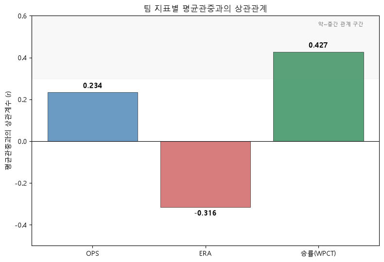

# KBO 공식 기록실 수집 리포트

## 1️⃣윤리 검토
- robots.txt: https://www.koreabaseball.com/robots.txt 사용가능
- Crawl-delay: 명시 없음 → 안전을 위해 자체적으로 2초 적용
- 요청 예의: time.sleep + User-Agent 적용
- 저작권/개인정보: 본 프로젝트는 학습용으로 비상업적이며 재배포하지 않음. 또한 개인 정보 포함하지 않음

## 2️⃣페이지 판별
- 정적페이지: 
    혼합형(그래프+표), 그래프는 호출하지 않고 접속시 발생하는 응답만 관찰하여 수집(`GraphTeam.aspx`)
- 선택한 도구: playwright
- 이유: 
    팀 기록은 bs4으로 가능했지만 차트가 있어서 Dataframe으로 변환한 후 다시 차트화 해야했으며 bs4로 진행하기에 한계가 있어서 Playwright로 진행

## 3️⃣분석 질문
**1. 데이터 선정 이유**
    야구가 데이터 분석하기에 최적화 되어있는 스포츠라고 생각하기 때문에 선정하였음

**2. 초기 목표**
    날짜별 관중수, 양팀 스코어, 날짜별 선수지표를 가지고 비교해서 팀의 인기 선수들의 활약이 관중 증가와 어떤 상관관계가 있는지 보고 싶었으나 크롤링 과제 단계에서 하기엔 너무 무거워서 포기하였다. (경기별 타자의 OPS, ERA 전부 다시 계산해야함) 
    또한 투수 지표를 선발/계투/마무리 등 역할별로 나누어 비교하는 방안도 생각했었다. WHIP 같은 지표는 등판 이닝 수와 상황(리드 시 등판 등)이 역할마다 크게 달라 그대로 비교하면 공정하지 않다고 판단했기 때문이다. 그래서 역할별 세부 스탯을 제공하는 STATIZ 사이트를 확인하였으나, robots.txt에서
    `User-agent: *`에 대해 `Disallow: /`로 전체 크롤링이 차단되어 있어서 팀 단위 지표(OPS, ERA)로 지표를 대신했다.

**3. 지표 설명**
여기서 모든 지표는 2026년 KBO 정규시즌만을 사용, 2026년 7월23일까지의 기준으로 작성

- 타자 지표: 
    팀 OPS사용, 팀득점 또는 타점은 선행타자가 출루가 안될경우 기록할 수 없음, 즉 타자 개인별 능력을 나타내기에는 부족함
    OPS는 출루율 + 장타율, 출루율은 안타 또는 볼넷으로 출루하는 능력, 장타율은 타격의 능력을 나타냄으로 순수한 타자의 타격 능력을 표현하기에 OPS가 나아서 선정하였다

- 투수 지표: 
    R (실점): 우리팀이 단순하게 얼마의 실점을 하였는가
    ER (자책점): 수비 실책으로 인해 내준 점수는 제외하고 투수 책임으로 내준 점수만 집계
    ERA (평균자책점):  ER을 9이닝당 평균으로 정규화 한 값
    ERA로 진행한 이유: 이닝을 많이 던진팀이 더 불리하게 나올 수 있으므로 이닝 수 차이를 보정한 지표로 ERA가 더 공정하다고 판단하여 사용하였다

- 관중수: 
    팀 별로 진행한 경기수가 같지 않고 관중수는 원래 홈경기만 집계하기 때문에 평균관중수로 정규화해주었음. 
    평균관중수 = 총관중수 ÷ 홈경기수

- 승률: 
    OPS가 높고 ERA가 낮으면 승률로 연결될 확률이 높지만 이게 진짜 관중수와 연관이 있는지 아니면 다른 또다른 변수가 있는지 확인을 추가로 더 진행할 계획을 세울 때 사용함

## 4️⃣정제 (재적용한 랭글링)
- 타입: OPS, ERA, 승률이 문자열(str)이라 숫자형으로 변환, 이후 팀별로 병합시켜줌
- 공백: 0건
- 결측: 0건
- 이상치: 정상범주내 값이라 처리 0건

## 5️⃣인터랙티브 차트 보기

- [OPS vs 평균관중](https://jiwoon-oh.github.io/ai-data-bootcamp/D010/ops_chart.html)
- [ERA vs 평균관중](https://jiwoon-oh.github.io/ai-data-bootcamp/D010/era_chart.html)
- [승률 vs 평균관중](https://jiwoon-oh.github.io/ai-data-bootcamp/D010/wpct_chart.html)
- [OPS × ERA 산점도](https://jiwoon-oh.github.io/ai-data-bootcamp/D010/scatter_chart.html)

## 6️⃣상관관계 확인 및 시각화 인사이트

- **승률(r=0.427)**
    이 세 지표 중 관중수와 가장 밀접한 관계를 보였다.
    이는 "타격이나 투구 하나의 지표"보다 "실제로 이기고 있는가"라는
    결과 자체가 관중 동원에 더 많은 점을 차지한다고 볼 수 있었다.

- **ERA(r=-0.316)**
    음수지만 ERA는 낮을수록 좋은것이기 때문에 실제로는 0.316의 상관관계로 보는것이 맞다. OPS보다 상관관계가 더 뚜렷했다. 즉 이번 데이터에서는
    타격 지표보다 투수력(실점 억제)이 관중수와 조금 더 강하게 연결되는
    경향을 보였다.

- **OPS(r=0.234)** 
    세 지표 중 가장 약한 상관을 보였다. 타격 성적이
    좋다고 해서 반드시 관중이 느는 것은 아니라는 뜻이다.

- 다만 세 상관계수 모두 "강한 상관(보통 |r|≥0.7 이상)"이라 보기는
  어려운 수준이었고 예를 들어 KT는 승률 0.593(2위)으로 상위권 성적이었지만 평균관중은 14,055명으로
  10개 팀 중 최하위권에 속했다. 반대로 롯데는 승률 0.455로 하위권이었지만 평균관중은 20,009명으로 상위권을 기록했다.

이런 예외는 성적보다 연고지, 팬덤, 인기 선수 등 다른 구조적 변수들이 관중수 동원에
함께 영향을 주고 있음을 보여준다.
성적이 좋을수록 관중이 늘어나는건 관찰되지만 이것만으로 관중수를 전부 설명하기에는 부족하다
연고지, 시장 규모, 인기 선수 등 추가 변수를 반영하면 더 정교한 관계를 설명할 수 있을것 같다

## 7️⃣한계 보완
- 각 날짜마다 출전한 선수와 그날의 스코어, 관중수를 같이 비교하면 팀의 승리와 선수 개인의 활약 중 어떤것이 관중 숫자에 더 영향을 미치는지 알 수 있지 않을까 생각한다. 또한 지금은 표본 수가 적어(10개 팀) 이번 분석에서 나타난 투수 지표(ERA)와 타자 지표(OPS)의 상관관계 차이가 우연인지 실제 경향인지 확신하기 어려웠는데 5~10년치 데이터를 가지고 추가로 더 분석하면 투수와 타자별 어느 포지션이 관중수를 증가시키는데 더 밀접한 연관이 있는지 알 수 있지 않을까 싶다.

- 현재 데이터에는 예외들이 존재하는데 예를들어 KT(승률 2위, 평균관중 최하위권)와 롯데(승률 하위권, 평균관중 상위권)처럼 성적과 관중수가 반대로 움직이는 예외 사례가 있었다. 아마도 연고지 도시 인구, 홈구장 수용인원, 구단 창단 연도 같은 다른 변수들이 같이 작용했을 것이다. 따라서 이와 같은 변수들을 추가로 수집해서 분석해본다면 `시장 규모`와 `성적`중 어느쪽이 관중수에 더 큰 영향을 미치는지 알 수 있을것이다. (관중점유율 등)