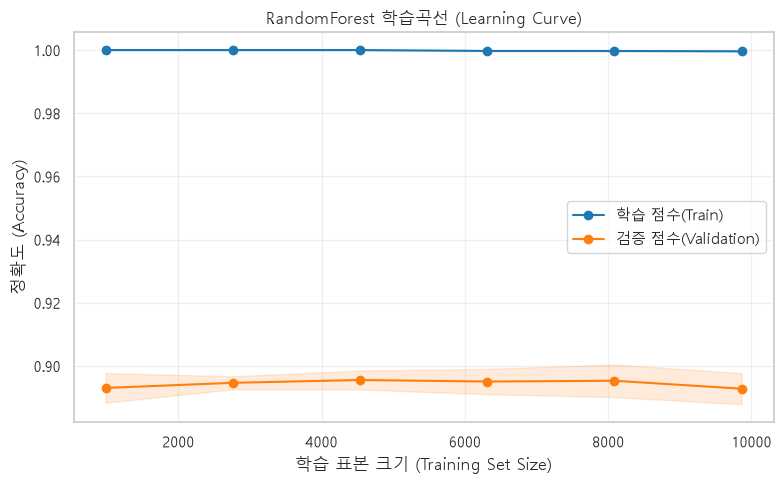

## 모델 카드 v3 — 구매 전환 예측

- 데이터: UCI Online Shoppers (12,330 세션, 수치형 10개 열만 사용)
- 문제 유형: 분류
- 베이스라인: DummyClassifier(most_frequent) = {strategy}
- **검증 방식: StratifiedKFold(n_splits=5, shuffle=True, random_state=42)**
- **성능: CV 정확도 { 평균 } ± { 표준편차 }  ← 숫자 하나로 적지 않습니다**

| 모델 | 홀드아웃 | CV 평균 | CV 표준편차 | 차이(홀드아웃-CV평균) |
|---|---|---|---|---|
| Dummy | 0.8451 | 0.8453 | 0.0002 | -0.0002 |
| Tree(기본) | 0.8423 | 0.8537 | 0.0017 | -0.0114 |
| Tree(max_depth=5) | 0.8942 | 0.8913 | 0.0040 | 0.0028 |
| RandomForest | 0.8946 | 0.8928 | 0.0049 | 0.0018 |
| XGBoost | 0.8889 | 0.8890 | 0.0041 | -0.0001 |

- **분할 운의 폭: 시드 10개 홀드아웃 { 최소 }~{ 최대 } (폭 { })**

| 모델 | 최소 | 최대 | 폭(최대-최소) | 평균 | 표준편차 |
|---|---|---|---|---|---|
| Tree(max_depth=5) | 0.8848 | 0.8986 | 0.0138 | 0.8918 | 0.0037 |
| RandomForest | 0.8897 | 0.9027 | 0.0130 | 0.8960 | 0.0037 |

- **한 번 재기 vs 여러 번 재기: { 순위나 값이 달라진 지점을 구체적으로 }**
- 과적합 진단: 학습 { 1.0000 } vs 테스트 { 0.8930 }, 격차 { 0.1070 } → { 과적합되어서 아무리 표본 크기를 늘려도 격차가 줄어들지 않음 }

- **복잡도 조정 전후: { max_depth, min_samples_leaf } 적용 시 CV { }→{ }, 격차 { }→{ }**
  - DecisionTree의 경우 max_depth 3~8 사이에서 cv 평균이 0.8879 - 0.8874가 나왔고 cv 표준편차는 0.0030 - 0.0026으로 max_depth = 5에서 가장 좋은 결과를 보였다 
  - RdandomForest의 경우 leaf = 1일때 격차가 0.09였지만 50으로 규제한 결과 학습점수 0.9055에 테스트 점수 0.8990으로 격차가 0.0065까지 줄어들었다

- **학습곡선 판단: 데이터 추가 { 가치 있음 / 없음 } — 근거: { 검증 곡선의 움직임 }**

  - 학습 점수와 검증 점수의 격차가 좁혀지지 않음 -> 규제를 주어서 과적합을 막아야함
  
- **다음 투자: { 데이터 / 피처 / 모델 중 무엇을, 왜 }**
- 한계 & 다음 단계: 평가지표를 Accuracy만 사용, 수치형 변수만 활용하고 범주형 변수는 활용하지 않았음, 클래스 불균형을 고려하지 않았음, 하이퍼파라미터가 단일변수로만 검증했음(조합신경안씀), XGBoost는 튜닝안함, 데이터 누수 가능성 미검증
- AI 사용 내역: 코드짜는것(특히 파이프라인 설계), 결과해석중 이해안가는것 몇가지