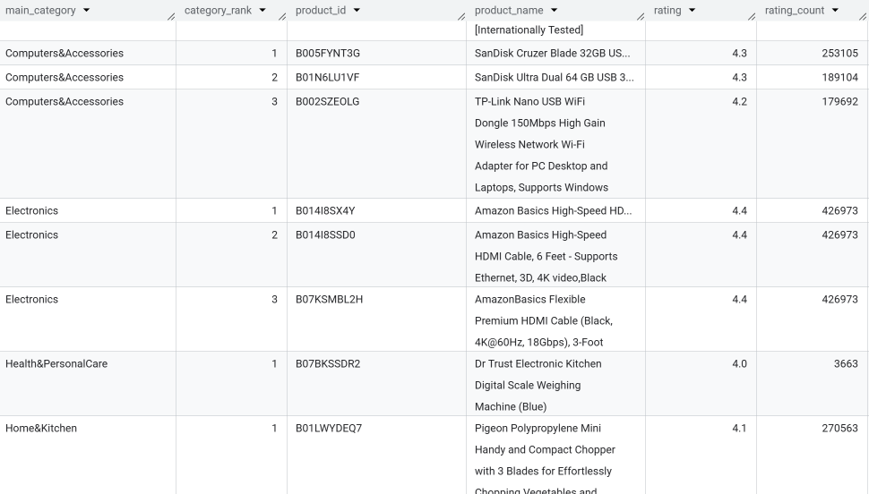
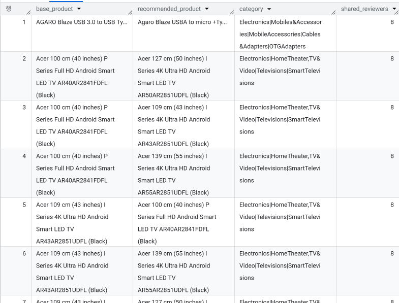
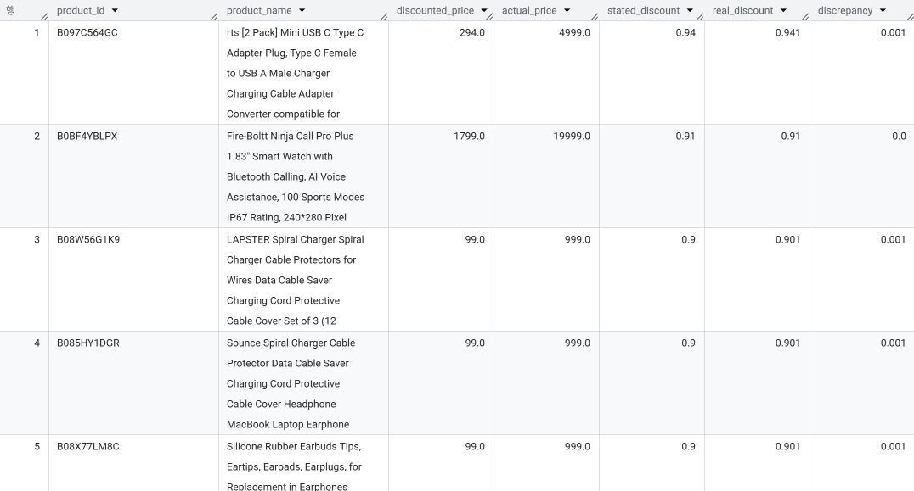
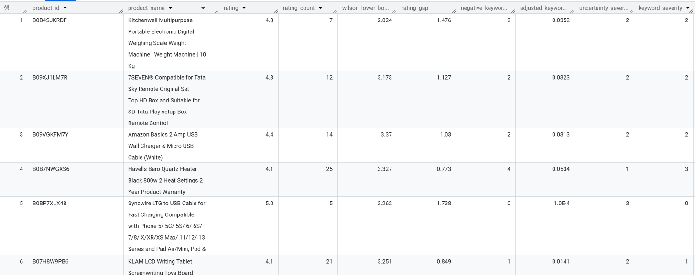
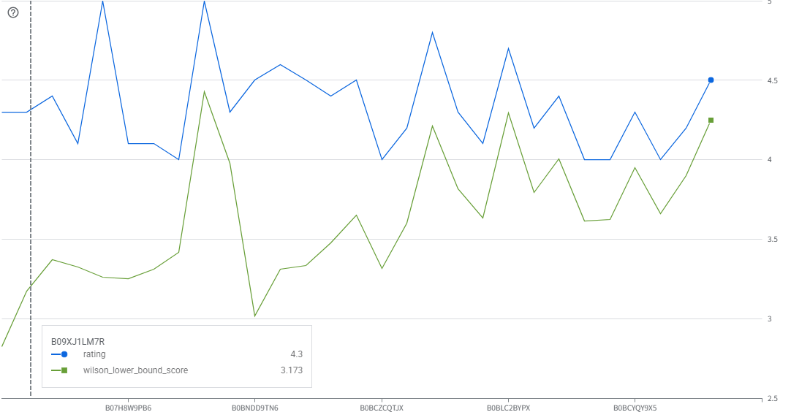

# Amazon 데이터셋 기반 추천 시스템 설계 프로젝트

## 프로젝트 개요

이번 프로젝트는 Amazon 데이터셋을 기반으로 고객 맞춤형 추천 시스템을 설계하고 구현하는 작업입니다. Amazon은 전 세계적으로 가장 큰 전자상거래 플랫폼 중 하나로, 방대한 고객 리뷰와 제품 데이터를 보유하고 있습니다. 이번 프로젝트에서는 이러한 데이터를 SQL만을 사용하여 분석하고, 고객의 구매 경험을 향상시킬 수 있는 추천 시스템의 기초를 설계하는 것이 목표입니다.

---

## EDA

### 발견한 문제점
- `rating_count`: 결측 2개
- `rating`: 원본 스키마 결과 STRING으로 표기되어 있었음 -> 확인해보니 값 하나가 | 로 표기되어 STRING으로 자동 감지됨
- `user_id`,`review_id`,`review_title`,`user_name`: 상품에 리뷰를 남긴 유저의 ID들이 전부 나열되어있음, `review_count`와 숫자가 맞는지 대조
  - 중복우려, 하지만 굳이 처리할 이유 없이 쿼리 단계에서 고유값으로 불러오면 됨

### 해결
- `rating_count` 칼럼은 극단값이 존재하며 분포가 매우 치우쳐져 있음 ➡️ 중앙값으로 대체
- `rating` 칼럼은 FLOAT 64로 변환 ➡️ INT64로 하면 정수로 바꾸면 정보 손실 우려


### 타입이 정리된 뷰로 사용
- 원본 손실 방지

---

## 추천시스템

### 1️⃣ "평점 높고 믿을 만한 상품"

1. 테마: 평점만 높은 건 리뷰 수가 적어서 신뢰도가 낮을 수 있으니, 평점(rating)과 평가 개수(rating_count)를 함께 고려해서 "진짜 검증된 고평점 상품"을 추천
2. 로직 스케치
    - `rating_count`가 일정 기준(예: 전체 중앙값 이상, 혹은 상위 25%) 넘는 상품만 필터, 그중에서 `rating` 높은 순으로 정렬
    - `rating` * `LOG(rating_count)` 같은 가중치 점수로 정렬하면 "평점도 높고 평가도 많은" 상품이 자연스럽게 상위로 옴
3. 코드

```sql
WITH product_agg AS (
  SELECT
    product_id,
    ANY_VALUE(product_name) AS product_name,
    ANY_VALUE(category) AS category,
    MAX(rating) AS rating,
    MAX(rating_count) AS rating_count
  FROM `my-project.ai_bootcamp_sql.amazon_sales_clean`
  GROUP BY product_id
),
threshold AS (
  SELECT APPROX_QUANTILES(rating_count, 2)[OFFSET(1)] AS median_rating_count
  FROM product_agg
)
SELECT
  p.product_id,
  p.product_name,
  p.category,
  p.rating,
  p.rating_count,
  ROUND(p.rating * LOG(p.rating_count + 1), 3) AS trust_score
FROM product_agg p
CROSS JOIN threshold t
WHERE p.rating_count >= t.median_rating_count
ORDER BY trust_score DESC
LIMIT 100;
```

4. 출력 화면 및 설명


- 중복 문제가 있으므로 `GROUP BY product_id`로 묶음
- `threshold`을 중앙값으로 잡아 리뷰수가 적어 평점이 높게 나온 상품들 제외
- trust_score = rating × LOG(rating_count + 1): 평점이 같아도 리뷰가 더 많은 상품에 가중치, 
    - `LOG`를 쓴 이유는 스케일 차가 커도 점수가 지나치게 벌어지지 않도록 방지

### 2️⃣ "카테고리별 베스트셀러"

1. 테마: 각 카테고리 안에서 가장 인기 있는 상품을 보여줘서 사용자가 관심 카테고리 내 1등 상품을 바로 찾게 함
2. 로직 스케치
    - `category` SPLIT(category, '|')[OFFSET(0)] 으로 대분류
    - PARTITION BY category_value ORDER BY rating_count DESC 윈도우 함수로 카테고리별 순위 매기기
    - `rank` <= 3 정도로 카테고리마다 Top 3만 추출
3. 코드

```sql
WITH product_agg AS (
  SELECT
    product_id,
    ANY_VALUE(product_name) AS product_name,
    SPLIT(ANY_VALUE(category), '|')[OFFSET(0)] AS main_category,
    MAX(rating) AS rating,
    MAX(rating_count) AS rating_count
  FROM `my-project.ai_bootcamp_sql.amazon_sales_clean`
  GROUP BY product_id
),
ranked AS (
  SELECT
    product_id,
    product_name,
    main_category,
    rating,
    rating_count,
    ROW_NUMBER() OVER (
      PARTITION BY main_category
      ORDER BY rating_count DESC
    ) AS category_rank
  FROM product_agg
)
SELECT
  main_category,
  category_rank,
  product_id,
  product_name,
  rating,
  rating_count
FROM ranked
WHERE category_rank <= 3
ORDER BY main_category, category_rank;
```

4. 출력 화면 및 설명



- `category`가 대분류|중분류|소분류 형식으로 이루어져 있기 때문에 가장 상위의 대분류만 사용하기 위해 `SPLIT(category, '|')[OFFSET(0)]` 사용
- `ROW_NUMBER() OVER (PARTITION BY category ORDER BY rating_count DESC)`를 사용하여 카테고리별 Top3만 추출
- ❗데이터 한계: Electronics 부분을 보면 `rating`과 `rating_count`가 3개 전부 같은것을 확인. 이유는 개별 상품으로 보는것이 아닌 **상품 패밀리 단위**
    로 측정되기 때문. 실제 중복을 제거해서 순위를 더 다양화 할 수 있지만 미니프로젝트 특성상 생략

### 3️⃣ "이 상품을 산 사람이 저 상품도 보았다"

1. 테마: 같은 리뷰어(`user_id`)가 여러 상품에 리뷰를 남긴 걸 이용해서, 리뷰어가 겹치는 상품끼리 "같이 보면 좋은 상품"으로 묶기
2. 로직 스케치
    - 각 상품 행의 `user_id`에는 여러개의 ID들이 존재, 이걸 `UNNEST`해서 상품X리뷰어 쌍으로 펼치고 같은 리뷰어가 등장하는 다른 상품을 찾는다.
    - 중복이 존재하기 떄문에 `DISTINCT product_id`로 같은 리뷰어가 중복되는것을 방지
    - `SELF JOIN`으로 상품 쌍을 만들고 공유하는 리뷰어 수를 세서 많이 겹칠수록 연관성 높은 상품으로 판단 
3. 코드

```sql
WITH product_reviewers AS (
  SELECT DISTINCT
    product_id,
    reviewer_id
  FROM `my-project.ai_bootcamp_sql.amazon_sales_clean`,
       UNNEST(SPLIT(user_id, ',')) AS reviewer_id
),
pairs AS (
  SELECT
    a.product_id AS product_a,
    b.product_id AS product_b,
    COUNT(DISTINCT a.reviewer_id) AS shared_reviewers
  FROM product_reviewers AS a
  JOIN product_reviewers AS b
    ON a.reviewer_id = b.reviewer_id
   AND a.product_id != b.product_id
  GROUP BY product_a, product_b
  HAVING shared_reviewers >= 2
),
ranked AS (
  SELECT
    product_a,
    product_b,
    shared_reviewers,
    ROW_NUMBER() OVER (PARTITION BY product_a ORDER BY shared_reviewers DESC) AS rn
  FROM pairs
)
SELECT
  pa.product_name AS base_product,
  pb.product_name AS recommended_product,
  pa.category,
  r.shared_reviewers,
FROM ranked AS r
JOIN `my-project.ai_bootcamp_sql.amazon_sales_clean` AS pa 
ON r.product_a = pa.product_id
JOIN `my-project.ai_bootcamp_sql.amazon_sales_clean` AS pb 
ON r.product_b = pb.product_id
WHERE r.rn <= 3
GROUP BY base_product, category, recommended_product, r.shared_reviewers
ORDER BY base_product, r.shared_reviewers DESC;
```

4. 출력 화면 및 설명



- `product_reviewers`: `product_id`랑 `reviewer_id`를 가져와서 나눈다
- `pairs`: self join으로 나눠서 같은 리뷰어가 남긴 다른 `product_id`를 찾는다
    리뷰어 X가 상품 A와 B에 리뷰를 남겼다, A와 B에 동시에 리뷰한 사람이 몇명인지 찾는것.
    `HAVING`으로 상품 A와 B를 동시에 리뷰한 사람이 2명 이상인 쌍만 가져온다.
- `ranked`: 세개를 가지고 와서 `product_a`의 값별로 `shared_reviewers`를 묶는다
- base product를 본사람이 recommended product도 본것

### 4️⃣ "진짜 혜택 상품"

1. 테마: 표시된 `discount_percentage`와 실제 (`actual_price` - `discounted_price`) / `actual_price`로 계산한 할인율을 비교해서 진짜 할인율이 큰 상품만 추천.
2. 로직 스케치
    - `discount_percentage`는 Amazon 페이지에 표시된 할인율
    - 직접 계산한 할인율과 비교해서 괴리(오차)가 큰 상품은 **표시만 그럴싸한** 상품으로 의심
    - 괴리가 작으면서(신뢰도 높음) 실제 할인율 자체도 높은 상품을 추천
3. 코드

```sql
WITH product_agg AS (
  SELECT
    product_id,
    ANY_VALUE(product_name) AS product_name,
    MAX(discounted_price) AS discounted_price,
    MAX(actual_price) AS actual_price,
    MAX(discount_percentage) AS stated_discount
  FROM `my-project.ai_bootcamp_sql.amazon_sales_clean`
  GROUP BY product_id
),
calc AS (
  SELECT
    product_id,
    product_name,
    discounted_price,
    actual_price,
    stated_discount,
    ROUND(SAFE_DIVIDE(actual_price - discounted_price, actual_price), 3) AS real_discount,
    ROUND(ABS(stated_discount - SAFE_DIVIDE(actual_price - discounted_price, actual_price)), 3) AS discrepancy
  FROM product_agg
  WHERE actual_price > 0
),
dedup AS (
  SELECT *,
    ROW_NUMBER() OVER (
      PARTITION BY product_name
      ORDER BY product_id
    ) AS name_rn
  FROM calc
  WHERE discrepancy <= 0.02
)
SELECT
  product_id, product_name, discounted_price, actual_price,
  stated_discount, real_discount, discrepancy
FROM dedup
WHERE name_rn = 1
ORDER BY real_discount DESC
LIMIT 100;
```
4. 출력 화면 및 설명



- `real_discount`: `SAFE_DIVIDE(actual_price - discounted_price, actual_price)`를 사용하여 혹시 0인 이상치가 나와도 `NULL`처리
- `discrepancy`(오차): `ABS(stated_discount - SAFE_DIVIDE(actual_price - discounted_price, actual_price)` 명시되어 있던 `discount_percentage`와 직접 구한
    진짜 할인률 비교
- `PARTITION BY product_name`으로 이름이 완전히 같은 상품끼리 묶고, name_rn = 1으로 대표상품 1개만 남긴다(같은 색상의 다른 상품들이 도배되는것 방지)

### 5️⃣ "이 상품, 정말 좋은 걸까?" 

1. 테마: 평점 4.0 이상인 상품들 중에서, 그 평점을 믿을 수 있는지 두 가지 방법으로 검증한다
2. 로직 스케치
    - 평점 자체의 신뢰도 검증 → `wilson_lower_bound_score`
    - 실제 리뷰 내용의 신뢰도 검증 → `adjusted_keyword_ratio`
    - 이 둘을 점수화해서 합 → `warning_score`

    1. **Wilson Lower Bound: 평점이 운이 좋았던건 아닐까**

      같은 성공률 95% 라해도 5번 던진것과 1000번 던진것은 신뢰도가 다르다. 이걸 상품평점에 적용해보면 rating=5.0, rating_count=5 → 리뷰 5개가 전부 만점, 하지만 
      리뷰가 너무 적어서 진짜 좋은건지 아니면 우연히 좋은 사람들만 리뷰를 남긴건지, 알바를 쓴건지 알 수 없음.
      rating=4.1, rating_count=827, 827명이 평가하면 신뢰도가 올라감.
      `wilson_lower_bound_score`는 전자의 경우, 점수를 많이 깎고(표본이 적어서) 후자의 경우 점수를 조금만 깎아 **리뷰가 적을수록 진짜 평점은 이것보다 낮을 수 있다**라고 신뢰구간을 제시함.
      `rating_gap` = 명시된 평점 - `wilson_lower_bound_score`을 사용하여 `rating_gap`이 클수록 평점과 보수적인 추정치 사이의 간극이 크다 라고 볼 수 있음.

    2. **`adjusted_keyword_ratio`: 리뷰내용에 진짜 부정적인 키워드들이 있는지**

      `negative_keyword_count`는 `review_content`, `review_title`에서의 부정적인 단어를 카운트함.
      `negative_keyword_count` / `rating_count`로 **리뷰 대비 불만 비율**을 계산하고 전체 상품 평균 비율(`global_avg_ratio`)을 가상으로 섞어서 완충시킨다.
      정리하면 리뷰가 많을수록 실제 비율에 가까워지고 리뷰가 적을수록 전체 평균쪽으로 끌려가게 된다. (베이지안 스무딩)

    3. `rating_gap`이 크면 `uncertainty_severity` (0~3점), `adjusted_keyword_ratio`이 높으면 `keyword_severity` (0~3점)
    이 둘을 합산하여 `warning_score`를 계산한다.

3. 코드

```sql
WITH product_agg AS (
  SELECT
    product_id,
    ANY_VALUE(product_name) AS product_name,
    MAX(rating) AS rating,
    MAX(rating_count) AS rating_count,
    STRING_AGG(DISTINCT review_content, ' ') AS review_content_all,
    STRING_AGG(DISTINCT review_title, ' ') AS review_title_all
  FROM `project-0715781d-692c-4d2f-8a5.ai_bootcamp_sql.amazon_sales_clean`
  GROUP BY product_id
),

-- 1) Wilson score 하한: 평점의 통계적 불확실성 보정
wilson AS (
  SELECT
    *,
    SAFE_DIVIDE(rating - 1, 4) AS p_hat,
    1.96 AS z
  FROM product_agg
),
wilson_score AS (
  SELECT
    *,
    SAFE_DIVIDE(
      p_hat + POW(z, 2) / (2 * rating_count)
        - z * SQRT(
            SAFE_DIVIDE(p_hat * (1 - p_hat), rating_count)
            + POW(z, 2) / (4 * POW(rating_count, 2))
          ),
      1 + POW(z, 2) / rating_count
    ) AS wilson_lower_bound_raw
  FROM wilson
),
wilson_final AS (
  SELECT
    *,
    ROUND(1 + wilson_lower_bound_raw * 4, 3) AS wilson_lower_bound_score,
    ROUND(rating - (1 + wilson_lower_bound_raw * 4), 3) AS rating_gap
  FROM wilson_score
),

-- 2) 부정 키워드 개수 + 베이지안 스무딩 비율: 리뷰 텍스트의 통계적 불확실성 보정
keyword_raw AS (
  SELECT
    product_id,
    rating_count,
    ARRAY_LENGTH(
      REGEXP_EXTRACT_ALL(
        LOWER(CONCAT(IFNULL(review_content_all, ''), ' ', IFNULL(review_title_all, ''))),
        r'\b(bad|worst|waste|defective|broke|broken|poor|disappointed|return|refund|fake|damaged|useless|cheap quality|stopped working|not working|faulty|leak|leaking|noisy|slow|late delivery|wrong item|misleading|scam|regret|junk|flimsy|died|dead|malfunction)\b'
      )
    ) AS negative_keyword_count
  FROM product_agg
),
global_stats AS (
  SELECT SAFE_DIVIDE(SUM(negative_keyword_count), SUM(rating_count)) AS global_avg_ratio
  FROM keyword_raw
),
keyword_final AS (
  SELECT
    k.*,
    g.global_avg_ratio,
    -- C=50: 리뷰 50건 규모의 "가상 사전 정보"로 소표본 비율을 완충
    ROUND(
      SAFE_DIVIDE(
        k.negative_keyword_count + 50 * g.global_avg_ratio,
        k.rating_count + 50
      ), 4
    ) AS adjusted_keyword_ratio
  FROM keyword_raw k
  CROSS JOIN global_stats g
),

-- 3) 두 지표 결합 및 점수화
scored AS (
  SELECT
    w.product_id,
    w.product_name,
    w.rating,
    w.rating_count,
    w.wilson_lower_bound_score,
    w.rating_gap,
    kf.negative_keyword_count,
    kf.adjusted_keyword_ratio,
    CASE
      WHEN w.rating_gap >= 1.5 THEN 3
      WHEN w.rating_gap >= 0.8 THEN 2
      WHEN w.rating_gap >= 0.3 THEN 1
      ELSE 0
    END AS uncertainty_severity,
    CASE
      WHEN kf.adjusted_keyword_ratio >= 0.05 THEN 3
      WHEN kf.adjusted_keyword_ratio >= 0.02 THEN 2
      WHEN kf.adjusted_keyword_ratio > 0.005 THEN 1
      ELSE 0
    END AS keyword_severity
  FROM wilson_final w
  JOIN keyword_final kf USING (product_id)
  WHERE w.rating >= 4.0   
),
final AS (
  SELECT
    *,
    uncertainty_severity + keyword_severity AS warning_score
  FROM scored
)
SELECT
  product_id,
  product_name,
  rating,
  rating_count,
  wilson_lower_bound_score,
  rating_gap,
  negative_keyword_count,
  adjusted_keyword_ratio,
  uncertainty_severity,
  keyword_severity,
  warning_score,
  CASE
    WHEN warning_score >= 4 THEN '🔴위험'
    WHEN warning_score >= 2 THEN '🟡주의'
    ELSE '안전'
  END AS risk_level
FROM final
WHERE warning_score >= 2
ORDER BY warning_score DESC, rating_gap DESC, adjusted_keyword_ratio DESC
LIMIT 100;
```

4. CTE 설명

- Wilson: 5점 만점을 확률로 계산(p_hat = (rating - 1) / 4) 통계에서 사용하는 95% 신뢰구간이라고 이해
- wilson_score: `wilson_lower_bound` = [ p̂ + z²/2n − z·√(p̂(1−p̂)/n + z²/4n²) ] / (1 + z²/n) 
  **평점(p_hat)에서 리뷰(n)가 적을수록 더 많이 깎는 계산**
  n이 크면 항들이 0에 가까워져 표시 평점과 큰 차이가 없다, n이 작으면 항들이 커져 많이 깎인 점수가 나옴.
- wilson_final: `wilson_lower_bound_score` = 1 + `wilson_lower_bound` × 4, 다시 1~5점으로 돌리고 `rating_gap`을 계산함
  `rating_gap` = `rating` − `wilson_lower_bound_score`, 클수록 표시 평점을 믿을 수 없다.
- global_stats: 전체 평균 비율 계산(평균적으로 리뷰 100개당 부정 키워드가 몇 개 나오는지) 
  `global_avg_ratio` = (전체 상품의 부정 키워드 합) / (전체 상품의 리뷰 수 합)
- keyword_final: `adjusted_ratio` = (negative_count + 50 × global_avg_ratio) / (rating_count + 50)
  분자와 분모에 가상의 50개짜리 리뷰를 추가해준다. 리뷰가 적으면 실제 데이터보다 가상 데이터가 많아서 전체 평균쪽으로 끌려가고 리뷰가 많으면 무시가 가능해서 원래 비율 그대로 유지.
- scored: 임계값 설정
  `rating_gap` ≥ 1.5  → 3점
  `rating_gap` ≥ 0.8  → 2점
  `rating_gap` ≥ 0.3  → 1점 AS `uncertainty_severity`
  `adjusted_ratio` ≥ 0.05 → 3점
  `adjusted_ratio` ≥ 0.02 → 2점
  `adjusted_ratio` > 0.005 → 1점 AS `keyword_severity`
- final: 점수 합산
  `warning_score` = `uncertainty_severity` + `keyword_severity`
- warning_score, rating_gap, adjusted_keyword_ratio 내림차순으로 정렬

5. 출력 화면





- 파란선(`rating`, 표시 평점)과 초록선(`wilson_lower_bound_score`, 보수적 추정 평점), 두 선의 간극이 `rating_gap`
  왼쪽 부분은 rating gap이 크고 변동성이 심한 반면에 오른쪽 부분은 차이가 줄어들고 표시 평점과 비슷한 모양을 하고 있는것을 볼 수 있다.
