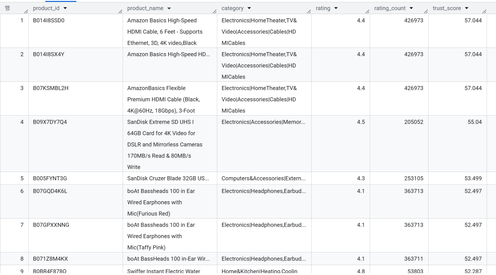

# Amazon 데이터셋 기반 추천 시스템 설계 프로젝트

## 프로젝트 개요

이번 프로젝트는 Amazon 데이터셋을 기반으로 고객 맞춤형 추천 시스템을 설계하고 구현하는 작업입니다. Amazon은 전 세계적으로 가장 큰 전자상거래 플랫폼 중 하나로, 방대한 고객 리뷰와 제품 데이터를 보유하고 있습니다. 이번 프로젝트에서는 이러한 데이터를 SQL만을 사용하여 분석하고, 고객의 구매 경험을 향상시킬 수 있는 추천 시스템의 기초를 설계하는 것이 목표입니다.

---

## EDA

### 발견한 문제점
- `rating_count`: 결측 2개
- `rating`: 원본 스키마 결과 STRING으로 표기되어 있었음 -> 확인해보니 값 하나가 | 로 표기되어 STRING으로 자동 감지됨
- `user_id`,`review_id`,`review_title`,`user_name`: 상품에 리뷰를 남긴 유저의 ID들이 전부 나열되어있음, `review_count`와 숫자가 맞는지 대조
  - 중복우려, 하지만 굳이 처리할 이유 없이 쿼리 단계에서 고유값으로 불러오면 됨

### 해결
- `rating_count` 칼럼은 극단값이 존재하며 분포가 매우 치우쳐져 있음 ➡️ 중앙값으로 대체
- `rating` 칼럼은 FLOAT 64로 변환 ➡️ INT64로 하면 정수로 바꾸면 정보 손실 우려


### 타입이 정리된 뷰로 사용
- 원본 손실 방지

---

## 추천시스템

### 1️⃣ "평점 높고 믿을 만한 상품"

1. 테마: 평점만 높은 건 리뷰 수가 적어서 신뢰도가 낮을 수 있으니, 평점(rating)과 평가 개수(rating_count)를 함께 고려해서 "진짜 검증된 고평점 상품"을 추천
2. 로직 스케치
    - `rating_count`가 일정 기준(예: 전체 중앙값 이상, 혹은 상위 25%) 넘는 상품만 필터, 그중에서 `rating` 높은 순으로 정렬
    - `rating` * `LOG(rating_count)` 같은 가중치 점수로 정렬하면 "평점도 높고 평가도 많은" 상품이 자연스럽게 상위로 옴
3. 코드

```sql
WITH product_agg AS (
  SELECT
    product_id,
    ANY_VALUE(product_name) AS product_name,
    ANY_VALUE(category) AS category,
    MAX(rating) AS rating,
    MAX(rating_count) AS rating_count
  FROM `project-0715781d-692c-4d2f-8a5.ai_bootcamp_sql.amazon_sales_clean`
  GROUP BY product_id
),
threshold AS (
  SELECT APPROX_QUANTILES(rating_count, 2)[OFFSET(1)] AS median_rating_count
  FROM product_agg
)
SELECT
  p.product_id,
  p.product_name,
  p.category,
  p.rating,
  p.rating_count,
  ROUND(p.rating * LOG(p.rating_count + 1), 3) AS trust_score
FROM product_agg p
CROSS JOIN threshold t
WHERE p.rating_count >= t.median_rating_count
ORDER BY trust_score DESC
LIMIT 100;
```

4. 출력 화면 및 설명



- 중복 문제가 있으므로 `GROUP BY product_id`로 묶음
- `threshold`을 중앙값으로 잡아 리뷰수가 적어 평점이 높게 나온 상품들 제외
- trust_score = rating × LOG(rating_count + 1): 평점이 같아도 리뷰가 더 많은 상품에 가중치, 
    - `LOG`를 쓴 이유는 스케일 차가 커도 점수가 지나치게 벌어지지 않도록 방지

### 2️⃣ "카테고리별 베스트셀러"

1. 테마: 각 카테고리 안에서 가장 인기 있는 상품을 보여줘서 사용자가 관심 카테고리 내 1등 상품을 바로 찾게 함
2. 로직 스케치
    - `category` SPLIT(category, '|')[OFFSET(0)] 으로 대분류
    - PARTITION BY category_value ORDER BY rating_count DESC 윈도우 함수로 카테고리별 순위 매기기
    - `rank` <= 3 정도로 카테고리마다 Top 3만 추출