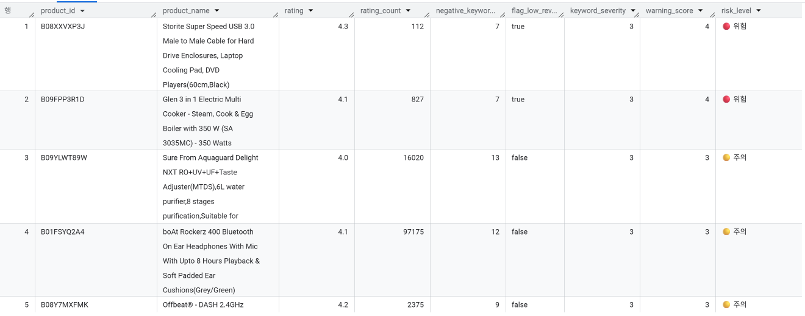

# Amazon 데이터셋 기반 추천 시스템 설계 프로젝트

## 프로젝트 개요

이번 프로젝트는 Amazon 데이터셋을 기반으로 고객 맞춤형 추천 시스템을 설계하고 구현하는 작업입니다. Amazon은 전 세계적으로 가장 큰 전자상거래 플랫폼 중 하나로, 방대한 고객 리뷰와 제품 데이터를 보유하고 있습니다. 이번 프로젝트에서는 이러한 데이터를 SQL만을 사용하여 분석하고, 고객의 구매 경험을 향상시킬 수 있는 추천 시스템의 기초를 설계하는 것이 목표입니다.

---

## EDA

### 발견한 문제점
- `rating_count`: 결측 2개
- `rating`: 원본 스키마 결과 STRING으로 표기되어 있었음 -> 확인해보니 값 하나가 | 로 표기되어 STRING으로 자동 감지됨
- `user_id`,`review_id`,`review_title`,`user_name`: 상품에 리뷰를 남긴 유저의 ID들이 전부 나열되어있음, `review_count`와 숫자가 맞는지 대조
  - 중복우려, 하지만 굳이 처리할 이유 없이 쿼리 단계에서 고유값으로 불러오면 됨

### 해결
- `rating_count` 칼럼은 극단값이 존재하며 분포가 매우 치우쳐져 있음 ➡️ 중앙값으로 대체
- `rating` 칼럼은 FLOAT 64로 변환 ➡️ INT64로 하면 정수로 바꾸면 정보 손실 우려


### 타입이 정리된 뷰로 사용
- 원본 손실 방지

---

## 추천시스템

### 1️⃣ "평점 높고 믿을 만한 상품"

1. 테마: 평점만 높은 건 리뷰 수가 적어서 신뢰도가 낮을 수 있으니, 평점(rating)과 평가 개수(rating_count)를 함께 고려해서 "진짜 검증된 고평점 상품"을 추천
2. 로직 스케치
    - `rating_count`가 일정 기준(예: 전체 중앙값 이상, 혹은 상위 25%) 넘는 상품만 필터, 그중에서 `rating` 높은 순으로 정렬
    - `rating` * `LOG(rating_count)` 같은 가중치 점수로 정렬하면 "평점도 높고 평가도 많은" 상품이 자연스럽게 상위로 옴
3. 코드

```sql
WITH product_agg AS (
  SELECT
    product_id,
    ANY_VALUE(product_name) AS product_name,
    ANY_VALUE(category) AS category,
    MAX(rating) AS rating,
    MAX(rating_count) AS rating_count
  FROM `my-project.ai_bootcamp_sql.amazon_sales_clean`
  GROUP BY product_id
),
threshold AS (
  SELECT APPROX_QUANTILES(rating_count, 2)[OFFSET(1)] AS median_rating_count
  FROM product_agg
)
SELECT
  p.product_id,
  p.product_name,
  p.category,
  p.rating,
  p.rating_count,
  ROUND(p.rating * LOG(p.rating_count + 1), 3) AS trust_score
FROM product_agg p
CROSS JOIN threshold t
WHERE p.rating_count >= t.median_rating_count
ORDER BY trust_score DESC
LIMIT 100;
```

4. 출력 화면 및 설명


- 중복 문제가 있으므로 `GROUP BY product_id`로 묶음
- `threshold`을 중앙값으로 잡아 리뷰수가 적어 평점이 높게 나온 상품들 제외
- trust_score = rating × LOG(rating_count + 1): 평점이 같아도 리뷰가 더 많은 상품에 가중치, 
    - `LOG`를 쓴 이유는 스케일 차가 커도 점수가 지나치게 벌어지지 않도록 방지

### 2️⃣ "카테고리별 베스트셀러"

1. 테마: 각 카테고리 안에서 가장 인기 있는 상품을 보여줘서 사용자가 관심 카테고리 내 1등 상품을 바로 찾게 함
2. 로직 스케치
    - `category` SPLIT(category, '|')[OFFSET(0)] 으로 대분류
    - PARTITION BY category_value ORDER BY rating_count DESC 윈도우 함수로 카테고리별 순위 매기기
    - `rank` <= 3 정도로 카테고리마다 Top 3만 추출
3. 코드

```sql
WITH product_agg AS (
  SELECT
    product_id,
    ANY_VALUE(product_name) AS product_name,
    SPLIT(ANY_VALUE(category), '|')[OFFSET(0)] AS main_category,
    MAX(rating) AS rating,
    MAX(rating_count) AS rating_count
  FROM `my-project.ai_bootcamp_sql.amazon_sales_clean`
  GROUP BY product_id
),
ranked AS (
  SELECT
    product_id,
    product_name,
    main_category,
    rating,
    rating_count,
    ROW_NUMBER() OVER (
      PARTITION BY main_category
      ORDER BY rating_count DESC
    ) AS category_rank
  FROM product_agg
)
SELECT
  main_category,
  category_rank,
  product_id,
  product_name,
  rating,
  rating_count
FROM ranked
WHERE category_rank <= 3
ORDER BY main_category, category_rank;
```

4. 출력 화면 및 설명


- `category`가 대분류|중분류|소분류 형식으로 이루어져 있기 때문에 가장 상위의 대분류만 사용하기 위해 `SPLIT(category, '|')[OFFSET(0)]` 사용
- `ROW_NUMBER() OVER (PARTITION BY category ORDER BY rating_count DESC)`를 사용하여 카테고리별 Top3만 추출
- ❗데이터 한계: Electronics 부분을 보면 `rating`과 `rating_count`가 3개 전부 같은것을 확인. 이유는 개별 상품으로 보는것이 아닌 **상품 패밀리 단위**
    로 측정되기 때문. 실제 중복을 제거해서 순위를 더 다양화 할 수 있지만 미니프로젝트 특성상 생략

### 3️⃣ "이 상품을 산 사람이 저 상품도 보았다"

1. 테마: 같은 리뷰어(`user_id`)가 여러 상품에 리뷰를 남긴 걸 이용해서, 리뷰어가 겹치는 상품끼리 "같이 보면 좋은 상품"으로 묶기
2. 로직 스케치
    - 각 상품 행의 `user_id`에는 여러개의 ID들이 존재, 이걸 `UNNEST`해서 상품X리뷰어 쌍으로 펼치고 같은 리뷰어가 등장하는 다른 상품을 찾는다.
    - 중복이 존재하기 떄문에 `DISTINCT product_id`로 같은 리뷰어가 중복되는것을 방지
    - `SELF JOIN`으로 상품 쌍을 만들고 공유하는 리뷰어 수를 세서 많이 겹칠수록 연관성 높은 상품으로 판단 
3. 코드

```sql
WITH product_reviewers AS (
  SELECT DISTINCT
    product_id,
    reviewer_id
  FROM `my-project.ai_bootcamp_sql.amazon_sales_clean`,
       UNNEST(SPLIT(user_id, ',')) AS reviewer_id
),
pairs AS (
  SELECT
    a.product_id AS product_a,
    b.product_id AS product_b,
    COUNT(DISTINCT a.reviewer_id) AS shared_reviewers
  FROM product_reviewers AS a
  JOIN product_reviewers AS b
    ON a.reviewer_id = b.reviewer_id
   AND a.product_id != b.product_id
  GROUP BY product_a, product_b
  HAVING shared_reviewers >= 2
),
ranked AS (
  SELECT
    product_a,
    product_b,
    shared_reviewers,
    ROW_NUMBER() OVER (PARTITION BY product_a ORDER BY shared_reviewers DESC) AS rn
  FROM pairs
)
SELECT
  pa.product_name AS base_product,
  pb.product_name AS recommended_product,
  pa.category,
  r.shared_reviewers,
FROM ranked AS r
JOIN `my-project.ai_bootcamp_sql.amazon_sales_clean` AS pa 
ON r.product_a = pa.product_id
JOIN `my-project.ai_bootcamp_sql.amazon_sales_clean` AS pb 
ON r.product_b = pb.product_id
WHERE r.rn <= 3
GROUP BY base_product, category, recommended_product, r.shared_reviewers
ORDER BY base_product, r.shared_reviewers DESC;
```

4. 출력 화면 및 설명


- `product_reviewers`: `product_id`랑 `reviewer_id`를 가져와서 나눈다
- `pairs`: self join으로 나눠서 같은 리뷰어가 남긴 다른 `product_id`를 찾는다
    리뷰어 X가 상품 A와 B에 리뷰를 남겼다, A와 B에 동시에 리뷰한 사람이 몇명인지 찾는것.
    `HAVING`으로 상품 A와 B를 동시에 리뷰한 사람이 2명 이상인 쌍만 가져온다.
- `ranked`: 세개를 가지고 와서 `product_a`의 값별로 `shared_reviewers`를 묶는다
- base product를 본사람이 recommended product도 본것

### 4️⃣ "진짜 혜택 상품"

1. 테마: 표시된 `discount_percentage`와 실제 (`actual_price` - `discounted_price`) / `actual_price`로 계산한 할인율을 비교해서 진짜 할인율이 큰 상품만 추천.
2. 로직 스케치
    - `discount_percentage`는 Amazon 페이지에 표시된 할인율
    - 직접 계산한 할인율과 비교해서 괴리(오차)가 큰 상품은 **표시만 그럴싸한** 상품으로 의심
    - 괴리가 작으면서(신뢰도 높음) 실제 할인율 자체도 높은 상품을 추천
3. 코드

```sql
WITH product_agg AS (
  SELECT
    product_id,
    ANY_VALUE(product_name) AS product_name,
    MAX(discounted_price) AS discounted_price,
    MAX(actual_price) AS actual_price,
    MAX(discount_percentage) AS stated_discount
  FROM `my-project.ai_bootcamp_sql.amazon_sales_clean`
  GROUP BY product_id
),
calc AS (
  SELECT
    product_id,
    product_name,
    discounted_price,
    actual_price,
    stated_discount,
    ROUND(SAFE_DIVIDE(actual_price - discounted_price, actual_price), 3) AS real_discount,
    ROUND(ABS(stated_discount - SAFE_DIVIDE(actual_price - discounted_price, actual_price)), 3) AS discrepancy
  FROM product_agg
  WHERE actual_price > 0
),
dedup AS (
  SELECT *,
    ROW_NUMBER() OVER (
      PARTITION BY product_name
      ORDER BY product_id
    ) AS name_rn
  FROM calc
  WHERE discrepancy <= 0.02
)
SELECT
  product_id, product_name, discounted_price, actual_price,
  stated_discount, real_discount, discrepancy
FROM dedup
WHERE name_rn = 1
ORDER BY real_discount DESC
LIMIT 100;
```
4. 출력 화면 및 설명


- `real_discount`: `SAFE_DIVIDE(actual_price - discounted_price, actual_price)`를 사용하여 혹시 0인 이상치가 나와도 `NULL`처리
- `discrepancy`(오차): `ABS(stated_discount - SAFE_DIVIDE(actual_price - discounted_price, actual_price)` 명시되어 있던 `discount_percentage`와 직접 구한
    진짜 할인률 비교
- `PARTITION BY product_name`으로 이름이 완전히 같은 상품끼리 묶고, name_rn = 1으로 대표상품 1개만 남긴다(같은 색상의 다른 상품들이 도배되는것 방지)

### 5️⃣ "이 상품, 정말 좋은 걸까?" 

1. 테마: 표시된 평점(`rating`)이 높다고 무조건 믿지 않고, 
    그 평점을 뒷받침할 근거(리뷰 수, 실제 리뷰 내용)가 충분한지 교차 검증해서 **의심스러운 상품에 경고를 매기는 시스템**
2. 로직 스케치
    - 상품 단위로 데이터 정리 (`product_id` 기준 GROUP BY, 리뷰 텍스트는 `STRING_AGG`로 합침)
    - **신호 1 — 리뷰 수 부족**: 평점 4.0 이상인데, `rating_count`가 전체 상품 중 하위 25%(1사분위) 이하인 상품 → "적은 리뷰로 만들어진 고평점" 의심
    - **신호 2 — 부정 키워드 언급**: `review_content` + `review_title`에서 불만/결함/신뢰 관련 키워드(defective, broke, refund, fake 등 약 25개)가 몇 번 등장하는지 정규식으로 카운트
    - 두 신호를 점수화해서 합산
        - 리뷰 수 부족 신호: 0 또는 1점
        - 부정 키워드 신호: 언급 빈도에 따라 0~3점 (1~2개: 1점, 3~5개: 2점, 6개 이상: 3점)
        - 합산 `warning_score` (0~4점)
    -`warning_score >= 2`인 상품만 추출해서, 점수 구간별로 🟢안전 / 🟡주의 / 🔴위험 등급 표시
3. 코드

```sql
WITH product_agg AS (
  SELECT
    product_id,
    ANY_VALUE(product_name) AS product_name,
    MAX(rating) AS rating,
    MAX(rating_count) AS rating_count,
    STRING_AGG(DISTINCT review_content, ' ') AS review_content_all,
    STRING_AGG(DISTINCT review_title, ' ') AS review_title_all
  FROM `my-project.ai_bootcamp_sql.amazon_sales_clean`
  GROUP BY product_id
),
threshold AS (
  SELECT APPROX_QUANTILES(rating_count, 4)[OFFSET(1)] AS q1_rating_count
  FROM product_agg
),
flags AS (
  SELECT
    p.product_id,
    p.product_name,
    p.rating,
    p.rating_count,
    (p.rating >= 4.0 AND p.rating_count <= t.q1_rating_count) AS flag_low_review_count,
    ARRAY_LENGTH(
      REGEXP_EXTRACT_ALL(
        LOWER(CONCAT(IFNULL(p.review_content_all, ''), ' ', IFNULL(p.review_title_all, ''))),
        r'\b(bad|worst|waste|defective|broke|broken|poor|disappointed|return|refund|fake|damaged|useless|cheap quality|stopped working|not working|faulty|leak|leaking|noisy|slow|late delivery|wrong item|misleading|scam|regret|junk|flimsy|died|dead|malfunction)\b'
      )
    ) AS negative_keyword_count
  FROM product_agg p
  CROSS JOIN threshold t
),
scored AS (
  SELECT
    *,
    -- 부정 키워드 개수를 3단계로 나눠서 점수화 (0~3점)
    CASE
      WHEN negative_keyword_count >= 6 THEN 3
      WHEN negative_keyword_count >= 3 THEN 2
      WHEN negative_keyword_count >= 1 THEN 1
      ELSE 0
    END AS keyword_severity,
    CAST(flag_low_review_count AS INT64) AS review_count_severity
  FROM flags
),
final AS (
  SELECT
    *,
    keyword_severity + review_count_severity AS warning_score
  FROM scored
)
SELECT
  product_id,
  product_name,
  rating,
  rating_count,
  negative_keyword_count,
  flag_low_review_count,
  keyword_severity,
  warning_score,
  CASE
    WHEN warning_score >= 4 THEN '🔴 위험'
    WHEN warning_score >= 2 THEN '🟡 주의'
    ELSE '🟢 안전'
  END AS risk_level
FROM final
WHERE warning_score >= 2
ORDER BY warning_score DESC, negative_keyword_count DESC
LIMIT 100;
```

4. 출력 화면 및 설명



- `product_agg`: 앞서 확인한 `product_id` 중복 이슈를 방어하면서, 리뷰 텍스트를 상품 단위로 합치는 준비 단계
- `threshold`: "리뷰 수가 적다"를 판단할 기준선(하위 25%)을 데이터 자체에서 계산 — 고정값이 아니라 분포 기반이라 데이터가 바뀌어도 자동으로 맞춰짐
- `flags`: 두 가지 위험 신호(리뷰 수 부족 / 부정 키워드)를 각각 계산
- `scored`: 부정 키워드는 "있다/없다"가 아니라 **빈도**를 반영해 심각도를 3단계로 세분화
- `final`: 두 신호를 합산해 최종 `warning_score` 산출, 등급 라벨 부여
- ❗한계: 부정 키워드 탐지는 단순 문자열이라 문맥을 파악하지는 못함, 리뷰가 많은 케이스는 당연히 부정적인 문자도 들어갈 확률이 높아 공정성 부분에 한계가 있음