# Dunnhumby - The Complete Journey 리테일 매출 분석

## 프로젝트 개요
Dunnhumby "The Complete Journey" 공개 데이터셋을 기반으로, 안정 관측구간 동안
**총매출이 증가한 원인**을 가설 트리 → 로직 트리 → 통계적 검증 순으로 분해하는 팀 프로젝트.

- 데이터 출처: [Kaggle - Dunnhumby The Complete Journey](https://www.kaggle.com/datasets/frtgnn/dunnhumby-the-complete-journey)
- 분석 프레임워크: 문제정의(가설트리) → 지표지도(AARRR) → 원인분해(로직트리) → 통계검증 → ML → 결론 → 대시보드

## 핵심 발견 (EDA)
- 초반(온보딩 구간)·말미(관측 절단 구간)를 제외한 **안정 구간** 기준으로 총매출은 증가 추세
- `총매출 = 활성 가구 수 × 가구당 방문 빈도 × 방문당 객단가` 로 분해했을 때,
  가구 수·방문 빈도는 안정 구간 내내 평평했고 **객단가만 유일하게 완만히 상승**

## 가설 트리 (H1 ~ H5)
```
전체 기간 총매출이 증가했다
├── H1. 활성 가구 수 자체가 늘었다
├── H2. 가구당 방문(장바구니) 빈도가 늘었다
├── H3-A. 방문당 객단가가 늘었다 — 구매 믹스 변화
├── H3-B. 방문당 객단가가 늘었다 — 가격/할인 변화
├── H4. 매출 증가가 소수 우수고객(상위 지출 가구)의 지출 확대에 집중되어 있다
└── H5. 매출 증가는 특정 시점(계절)에 집중되어 있다
```

## 팀 분업

| 담당 | 가설 | 상태 |
|---|---|---|
| - | H1 (활성 가구 수 / 신규·재활성화 라벨링) | 진행중 |
| - | H2 (방문 빈도 / 캠페인·프로모션 노출) | - |
| - | H3-A, H3-B (구매 믹스 / 가격·할인) | - |
| **본인** | **H4 (우수고객 지출 집중도)** | 방법론 검증 완료, 통계검증(4단계) 진행 예정 |
| - | H5 (계절성 스파이크) | - |

## H4 진행 상황
- **가설**: 매출 증가가 상위 지출 가구(우수고객)에 집중되어 있다
  - H4-1: 안정구간 초반 기준 고정 상위 X% 가구의 매출 비중·절대 지출액이 후반에 늘었다
  - H4-2: 상위 지출군과 신규/재활성화 여부는 연관이 있다
- 로직트리(2×2 완전분해, 사칙연산 검산 가능)로 재구성 완료
- 재활성화 컷오프(gap 기준) 데이터 기반 검토: 통계적 변곡점(~8주) vs 팀 제안(3개월=13주) 트레이드오프 확인
- **TODO**: 4단계(카이제곱·효과크기) 통계검증 → 5단계 로지스틱 회귀(우수고객 조기예측) → 6단계 액션 제안

## 데이터
`data/` 폴더에 Kaggle 원본 8개 CSV 배치 (용량 문제로 저장소에는 미포함, `.gitignore` 처리):


## 노트북
- `dunnhumby_data_overview.ipynb` — 8개 테이블 분포·결측·총매출 추이 확인
- `gap_analysis.ipynb` — 재활성화(win-back) 기준일 탐색용 구매 공백(gap) 분석

## H4. 매출 증가가 소수 우수고객(상위 지출 가구)의 지출 확대에 집중되어 있다

### 하위 가설
- H4-1: 안정구간 초반 기준 고정 상위 X% 가구의 (a)매출 비중과 (b)절대 지출액이 이후 기간에 모두 늘었다
- H4-2: 상위 지출군과 신규/재활성화 여부는 연관이 있다

---

### 1. 방법론 설계 — 순환논리 방지 원칙

"상위 X%"는 반드시 **초반 구간 데이터만으로 고정**한다. 후반 데이터를 섞어서 정의하면
"원래 상위였던 가구가 늘었는지"가 아니라 "늘어난 가구를 상위로 정의한" 것이 되어버려 순환논리가 된다.

"X%" 자체도 관례적인 20%를 바로 쓰지 않고, 실제 지출 집중도 분포(파레토 곡선)를 먼저 확인한 뒤 정하기로 함.

---

### 2. 초반 구간 길이(N주) 결정

**방법**: 가구별 초반 N주 지출액을 홀수주/짝수주로 나눠 각각 순위를 매기고, 두 순위 집합의 Spearman 상관계수를 계산.
N을 늘려가며 상관계수가 어떻게 변하는지 곡선으로 그려 elbow(완만해지는 지점)를 탐지.

**제약 조건**: 안정구간이 17 ~ 99주(총 83주)이므로, 초반구간이 전체의 10 ~ 15%(약 8~12주)를 넘지 않도록 상한을 둠.

**결과**:
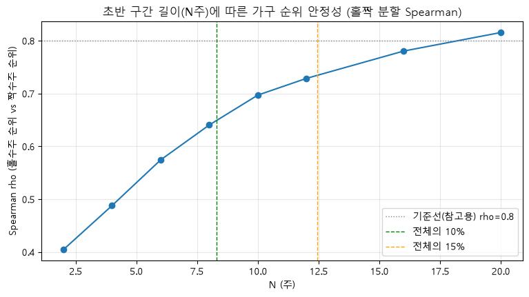
- kneed 기준 elbow: N=10주
- 해당 지점 상관계수: rho=0.697 (중간 정도 — 뚜렷한 elbow는 없었고, 어느 정도 노이즈가 있는 상태에서 X%를 정함)
- 10~15% 규칙(8~12주) 통과 확인

→ **N=10주로 우선 진행**, 추후 8주/12주로 민감도 체크 예정

---

### 3. 상위 X% 결정 — 파레토 곡선(로렌츠 곡선)

초반 10주 기준 가구별 지출액을 내림차순 정렬 → 누적 가구 비율(x) vs 누적 매출 비율(y)로 로렌츠 곡선을 그림.
완전 균등(y=x)이면 가설 자체가 성립하지 않고, 극단적으로 쏠려 있으면 곡선이 초반에 급격히 꺾인다.

**결과**:

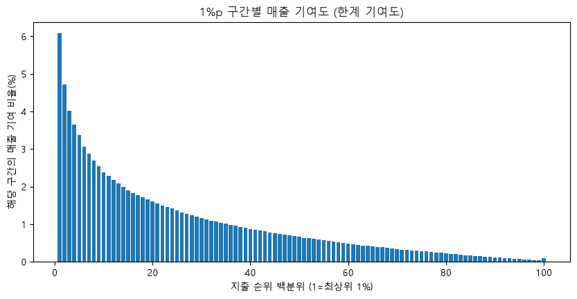
- Gini 계수 = 0.532 (0=완전균등, 1=완전독점 — 꽤 집중된 편)
- 관례적 파레토 법칙(20%→80%)과 달리, 이 데이터는 **상위 20%가 매출의 55.4%만 차지** (10%→36.1%, 30%→68.9%) → 파레토보다는 덜 극단적, 상위층이 더 쓰긴 하지만 중간층도 상당한 비중 차지
- 최상위 1%가 전체 매출의 6.1% 차지, 다만 뚜렷하게 꺾이는 지점(elbow)은 없음 — 매끄럽게 감소하는 분포
- kneed 기준 elbow: 상위 18% (관례적 20%와 거의 일치)

→ 데이터 기반 elbow(18%)와 관례적 기준(20%)이 근접 → **X=20%로 확정**

---

### 4. 이상치 처리 방침

IQR 기준으로는 SALES_VALUE의 7.34%가 이상치로 잡혔으나, 이 비율 자체가 "이상치가 많다"가 아니라
"이 분포(오른쪽 꼬리가 긴 지출 데이터)에 IQR 방법이 안 맞는다"는 신호로 해석.
또한 H4는 정확히 "상위 지출 거래"를 보는 가설이라, 이를 제거하면 검증하려는 신호 자체를 지우는 셈이 됨.

→ **이상치를 제거하지 않고, 정규성 가정이 필요 없는 비모수·순위 기반 검정을 사용하는 것으로 대응**

---

### 5. 첫 관찰 — 예상과 반대 방향의 신호 발견

초반/후반 구간 가구별 diff(후반-초반 지출액) 평균을 그룹별로 확인한 결과:
- 나머지80%: +102.74 (증가)
- 상위20%: **-111.49 (감소)**

H4-1이 주장하는 방향("상위 지출가구의 지출이 더 확대됐다")과 **정반대**의 결과.
통계적 착시(회귀효과) 가능성을 배제하기 위해 민감도 체크를 계획보다 앞당겨 진행.

---

### 6. 민감도 체크 (N=8, 10, 12주)


| N(주) | 나머지 평균diff | 상위X% 평균diff |
|---|---|---|
| 8 | +92.42 | -97.16 |
| 10 | +102.74 | -111.49 |
| 12 | +117.85 | -120.21 |

- N을 늘려도 부호가 뒤집히지 않고 오히려 격차가 더 벌어짐 (회귀효과라면 반대여야 함)
- Jaccard 겹침 비율(상위X% 명단의 N간 일치도): 0.76~0.86 — 상위 그룹 구성원 자체가 안정적

→ **통계적 착시가 아니라 진짜 패턴으로 판단.** "초반에 많이 쓰던 가구는 후반에 지출이 줄고, 초반에 덜 쓰던 가구는 늘어나는 **지출 수준의 수렴(convergence) 현상**" 발견

---

### 7. 정규성 · 등분산성 확인

- 정규성: Shapiro-Wilk 검정 → 상위20%, 나머지80% 모두 기각 (비정규)
- 등분산성: Levene 검정 → 기각 (상위20% 분산이 나머지80%보다 3배 이상 큼)

→ **비모수 검정(Wilcoxon 부호순위검정, Mann-Whitney U) 사용 확정**

---

### 8. H4-1 통계적 검증 (본페로니 보정, α=0.05/3≈0.0167)

**검정 A** — 상위20% 가구 자체의 절대 지출액 변화 (Wilcoxon)
- p-value = 0.00002, 효과크기 r = -0.209 (감소 방향)
- 중앙값 diff = -131.45, 95% CI 전부 마이너스 → **유의하게 감소**

**검정 B** — 나머지80% 가구 자체의 절대 지출액 변화 (Wilcoxon, 대조군)
- p-value ≈ 0.0000, 중앙값 diff = +36.49, 95% CI (24.3, 50.1) → **유의하게 증가**

**검정 C** — 두 그룹의 증가폭 차이 (Mann-Whitney U)
- p-value ≈ 0.0000, 효과크기 r = 0.290 (세 검정 중 가장 뚜렷한 효과)
- 공통언어효과크기 = 0.355 (완전 무작위면 0.5여야 함 — 나머지80%가 상위20%보다 더 늘어난 경우가 훨씬 흔함)
- 95% CI (-227.7, -116.0), 0 미포함 → **그룹 간 차이 유의**

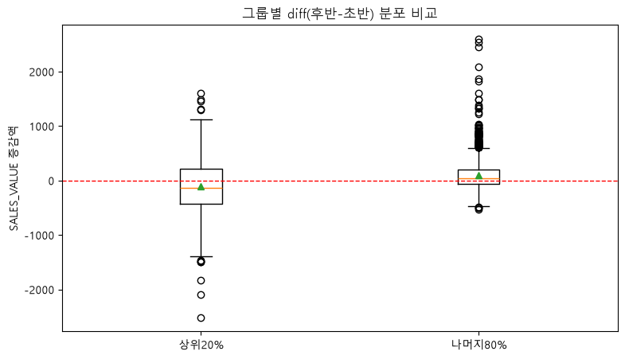

세 검정 모두 유의, 방향도 일관(상위 감소·나머지 증가) → **H4-1(금액 관점) 기각**

**검정 D** — 상위20%의 매출 비중(share) 변화 (부트스트랩 5,000회)
- 가구별 값이 아니라 시점당 비중 값 1개씩이라 순위 기반 검정 불가 → 복원추출 재표본화로 95% CI 직접 산출
- 초반 비중 54.87% → 후반 비중 41.96% (**-12.91%p**)
- 95% CI (-14.74%p, -11.09%p), 0 미포함 → **비중도 유의하게 감소**

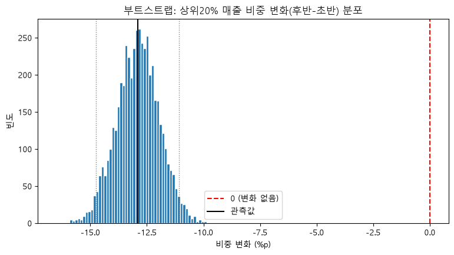

---

### 9. H4-1 최종 결론

금액(절대액)과 비중 두 관점 모두에서 상위20%의 위축이 확인됨 — **H4-1 원 가설 기각**.
대신 "상위-하위 고객 간 지출 격차가 좁혀지는 **탈집중화(수렴) 현상**"이 통계적으로 뒷받침됨.
상위 지출가구의 이탈/둔화 신호일 수도, 중하위 고객군의 성장일 수도 있어 추가 확인 필요.

---

### 10. H4-2 착수 — 신규/재활성화 정의 확정 및 2×2 교차표 설계

H4-1로 매출 증가를 실제로 견인한 게 나머지80%임이 확인됨에 따라, 이 성장이 (1)기존 활성가구의 자연 성장인지
(2)신규·재활성화 가구 유입인지를 확인하기 위해 H4-2 진행.

**라벨 정의**
- 신규: 전체 관측기간 중 첫 구매일이 안정구간 시작(week 17) 이후인 가구
- 재활성화: 신규가 아니면서 구매 공백이 13주(91일) 이상이었던 적이 있는 가구
- 기존: 위 두 조건에 모두 해당하지 않는 가구

### 11. H4-2 통계적 검증 — 2×2 교차표 (카이제곱)

**라벨링 결과 (전체 관측기간 기준)**
- 기존: 1,565가구, 재활성화: 726가구, 신규: 209가구 (합계 2,500 — 전체 가구 수와 일치 확인)

**2×2 교차표 (그룹 내 신규·재활성화 비중)**

| | 기존 | 신규·재활성화 |
|---|---|---|
| 나머지80% | 1,127명 (56.5%) | 866명 (**43.5%**) |
| 상위20% | 431명 (86.4%) | 68명 (**13.6%**) |


**검정 결과**
- 기대빈도 최소값 187 (>5) → 카이제곱 검정 조건 충족
- chi2 p-value ≈ 0.000000
- 효과크기(Cramér's V) = 0.246 (중간 정도 크기 — 통계적으로 유의하고, 무시 못할 크기의 차이)

→ **H4-2 통계적으로 유의: 상위 지출군과 신규/재활성화 여부는 연관이 있다**
- 나머지80%(H4-1에서 매출 증가를 견인한 그룹)는 43.5%가 신규·재활성화
- 상위20%(H4-1에서 위축된 그룹)는 13.6%만 신규·재활성화, 86.4%가 기존 고객

---

### 12. H4-2 인과관계 검증 — 신규·재활성화 가구의 실제 기여분

2×2 교차표는 **상관관계**일 뿐, 인과관계를 증명하지 않는다. 두 가지 경쟁 시나리오를 구분하기 위해
신규·재활성화 가구만 따로 떼어, 이들의 실제 지출 변화(diff)와 나머지80% 전체 증가분 중 기여 비중을 직접 계산.

- **시나리오 A**: 신규·재활성화 가구가 새로 들어와서 매출을 실제로 늘렸다 (인과적 기여)
- **시나리오 B**: 신규·재활성화 가구는 원래 지출 규모가 작아 나머지80%에 몰려있을 뿐, 매출 기여 자체는 작다

**나머지80% 그룹 내 cohort별 순증가 기여분**

| cohort | 인원 비중 | 기여 비중(금액) | 중앙값 diff |
|---|---|---|---|
| 기존 | 56.5% | **70.0%** | 51.78 |
| 신규·재활성화 | 43.5% | **30.0%** | 10.26 |


→ **기여 비중(30%)이 인원 비중(43.5%)보다 오히려 작음** — 신규·재활성화 가구는 머릿수는 많지만,
1인당 매출 기여도는 오히려 작다. 기존 가구의 중앙값 diff(51.78)가 신규·재활성화(10.26)보다 약 5배 큼.

**Mann-Whitney U 검정 (나머지80% 내, 신규·재활성화 vs 기존)**
- p-value = 0.000928 (본페로니 기준 통과, 통계적으로 유의)
- 효과크기(rank-biserial) = 0.086 (**매우 작음**)
- 공통언어효과크기 = 0.457 (완전 무작위 0.5에 근접)

→ 표본이 커서(1,993명) 통계적으로는 유의하게 나오지만, **효과 크기 자체는 무시해도 될 만큼 작음** (유의함 ≠ 중요함의 사례)

---

### 13. H4-2 최종 결론

- **상관관계는 확인됨**: 신규·재활성화 가구는 상위20%가 아닌 나머지80%에 압도적으로 몰려있음 (Cramér's V=0.246)
- **인과적 기여는 크지 않음**: 나머지80%의 실제 매출 증가분 중 70%는 여전히 **기존 가구**에서 나왔고, 신규·재활성화는 30%(인원 비중보다 낮은 몫)만 기여
- 즉 **매출 증가의 실질적 주역은 신규·재활성화 유입이 아니라 기존 활성가구의 자연스러운 지출 증가**

**H4 전체 최종 요약**

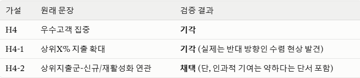

### 14. H4 재검증 — 상위20% 위축 예측 모델 (5단계: 머신러닝)

H4-1(수렴 현상)·H4-2(신규·재활성화 연관, 단 인과 근거는 약함) 결론에 이어, 통계로는 "무엇이 일어났는가"까지만
확인했으므로 "왜 일어났는가·누구에게 다음에 일어날 것인가"를 ML로 추가 확인한다.

**문제 설정**
- 대상: 초반(week 17~26) 기준 상위20%였던 가구 (499명)
- 라벨: 후반(week 90~99)에도 상위20%를 유지했는가(0) vs 밀려났는가(1) — 단순 diff<0이 아니라 **순위 재계산 기준**
- 모델: 로지스틱 회귀(해석 우선) + 랜덤포레스트·SHAP(비선형·상호작용 확인)
- 평가지표: PR-AUC + Recall(위험군을 놓치지 않는 게 중요) — 정확도는 참고용
- 검증방식: 표본이 작아(499명) 단순 train/test 분리 대신 **StratifiedKFold 5-fold**
- 의의: "우수고객 이탈 조기예측"으로 이어지는 실무적 액션 — 위험 요인이 확인되면 마케팅팀의 액션플랜 도출 가능

---

### 15. 신규 테이블 EDA — 분포·결측·중복 확인

| 테이블 | 확인 결과 |
|---|---|
| `hh_demographic` | 전체 안정구간에서 32.1% 보유, **상위20% 가구에서는 63.9%로 오히려 높음** (로열티 설문 응답자가 지출도 많은 경향으로 추정). 결측 36.1%(180명)는 "정보없음" 카테고리로 처리 |
| `causal_data` | 결측·중복 없음. DISPLAY/MAILER 코드값 확인 (0=노출없음, 그 외=노출있음) |
| `product` | product_id 1:1 매핑 확인, 조인 문제없음 |
| `coupon_redempt` | 전체 활동이 DAY 225 이후부터 시작 — **초반 구간(DAY 111~180)엔 활동 자체가 없어 feature 탈락** |
| `campaign_table`/`campaign_desc` | 마찬가지로 초반 구간과 겹치는 캠페인 0건 — **탈락** |

---

### 16. 피처 엔지니어링

1. **인구통계 결측 처리**: 36.1%(180명)를 "정보없음"으로 채움. 단, 원본에 이미 존재하는 "Unknown"(설문에 응했지만 해당 항목 무응답)과는 다른 개념이므로 인코딩 시 혼동 주의
2. **라벨 분포**: 위축 44.7% vs 유지 55.3% — 불균형 문제 없음
3. **이상치 처리**: household 13, 17 등에서 QUANTITY 합계가 7,660·2,559로 비정상 (무게/부피 단위 상품 혼입 추정) → `avg_qty_per_basket`(수량 합계 기반) 대신 **`avg_items_per_basket`(고유 상품 개수 기반)**로 전환
4. **그룹별 기초 통계 — exposure_ratio**: 유지 그룹보다 **위축 그룹에서 오히려 노출 비율이 더 높음** (반직관적, 다변량 모델에서 재확인 필요)

---

### 17. 인코딩

1. 수치형 5개(sales_early, n_baskets, avg_items_per_basket, category_diversity, exposure_ratio) — 로지스틱 회귀용 표준화
2. `hh_demographic`의 "정보없음"은 `has_demo` 이진 변수 하나로 분리 처리 (여러 컬럼에 중복 표시되는 것 방지)
3. 순서형(ordinal) 인코딩 4개 — 순서를 살린 정수 인코딩, "정보없음"은 최빈값 대체 후 인코딩
4. 명목형(nominal) 인코딩 2개 — 원-핫 인코딩 (기준범주는 최빈값, 단 HH_COMP_DESC의 "Unknown"은 대가족 등 비전형 가구를 대리할 수 있어 기준범주로 쓰지 않고 독립 카테고리로 유지)

---

### 18. VIF (다중공선성) 확인

| feature | VIF |
|---|---|
| KID_CATEGORY_DESC_encoded | 26.68 |
| HOUSEHOLD_SIZE_DESC_encoded | 26.49 |

두 컬럼이 사실상 같은 정보(자녀 수 ↔ 가구원수)를 담고 있음이 확인되어 **KID_CATEGORY_DESC_encoded 제거**.
제거 후 모든 feature의 VIF가 5 이하로 하락 (HOUSEHOLD_SIZE_DESC_encoded: 26.49 → 4.8) — 최종 feature 18개 확정.

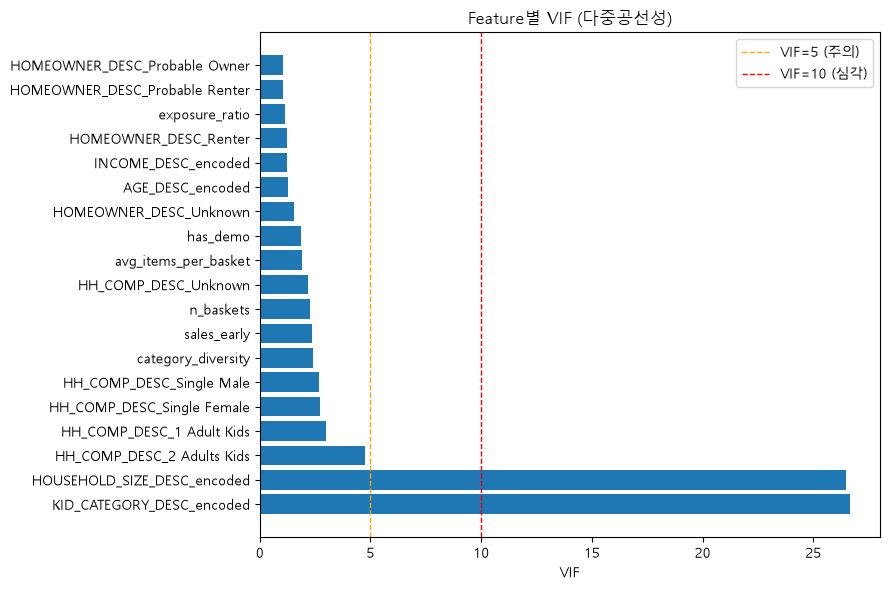

---

### 19. Train/Test 분리 방식

**StratifiedKFold 5-fold** 채택. 라벨 비율이 이미 44.7:55.3으로 준수하게 균형 잡혀 있어, 각 fold마다 이 비율이 유지되도록 하는 StratifiedKFold가 단순 무작위 분리보다 안정적.

---

### 20. 모델 1 — 로지스틱 회귀 (해석 우선)

**성능**
- 완전 무작위 기준선 PR-AUC ≈ 0.447 (라벨 비율과 동일)
- 모델 PR-AUC = 0.674 — 기준선 대비 뚜렷한 개선, 다만 fold별 산점도에서 변동폭 있음 (표본 작음의 영향)
- 혼동행렬: 실제 위축 223명 중 86명(약 39%)을 "유지"로 잘못 예측 — 아직 놓치는 비율 존재

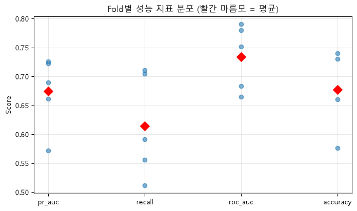
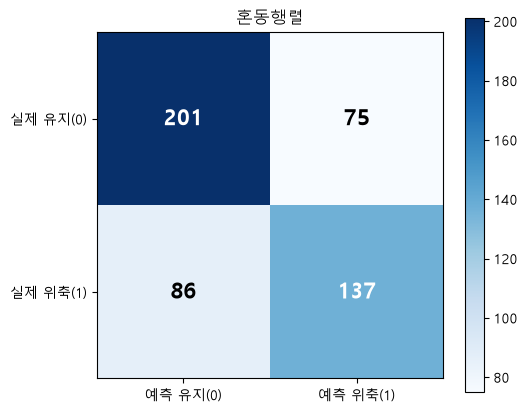

**오즈비 해석**
1. **has_demo(인구통계 보유)** — 가장 강력한 보호 요인(OR≈0.35). 설문 참여 자체가 리텐션 시그널일 가능성
2. **sales_early, category_diversity** — 둘 다 보호 요인. 지난 그룹별 기초통계와 같은 방향으로 재확인됨
3. **exposure_ratio** — 다른 변수 통제 후에는 오히려 보호 요인 쪽에 가까움 (단순 비교 때와 다른 결과 — 다변량 통제 효과)
4. **n_baskets(방문빈도)** — 위험 요인. 같은 지출액이면, 적게 자주 방문해 큰 장바구니로 채우는 가구보다 자주 방문하지만 소액 결제하는 가구가 상위권 유지에 더 취약할 가능성
5. HOMEOWNER_DESC_Unknown, Probable Owner — 표본이 적어 추정치가 불안정할 수 있음, 참고 수준

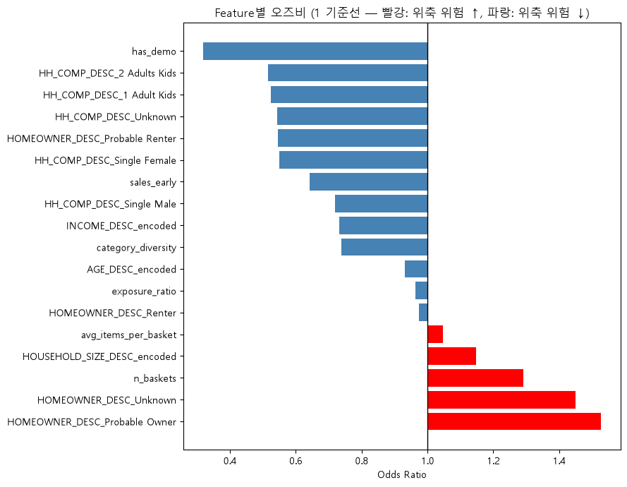

---

### 21. 모델 2 — 랜덤포레스트 + SHAP

**성능**: recall이 로지스틱보다 뚜렷하게 낮음(실제 양성을 잘 못 잡아내고, 애매하면 유지 쪽으로 예측하는 보수적 경향). 표본 크기(499명)가 트리 모델엔 불리하게 작용한 것으로 추정 → **이 데이터·표본 크기에서는 로지스틱 회귀가 더 나은 선택**

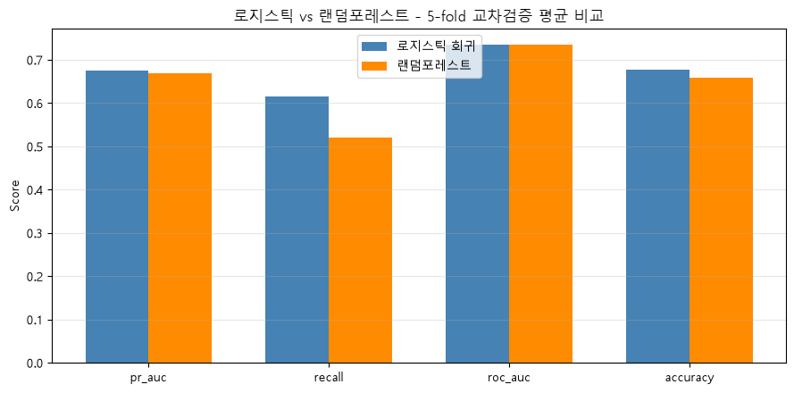
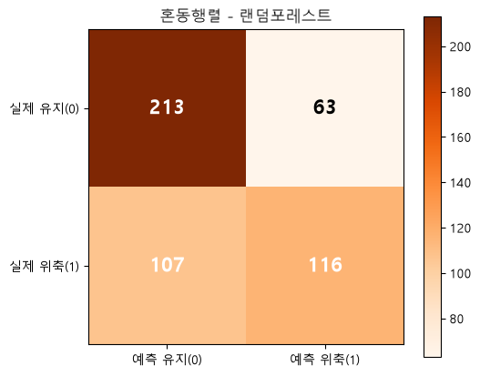

**SHAP 중요도 순위**: has_demo > sales_early > category_diversity > INCOME_DESC > avg_items_per_basket — 로지스틱 오즈비 순위와 거의 동일. **모델이 달라도 핵심 feature는 서로 교차검증됨**

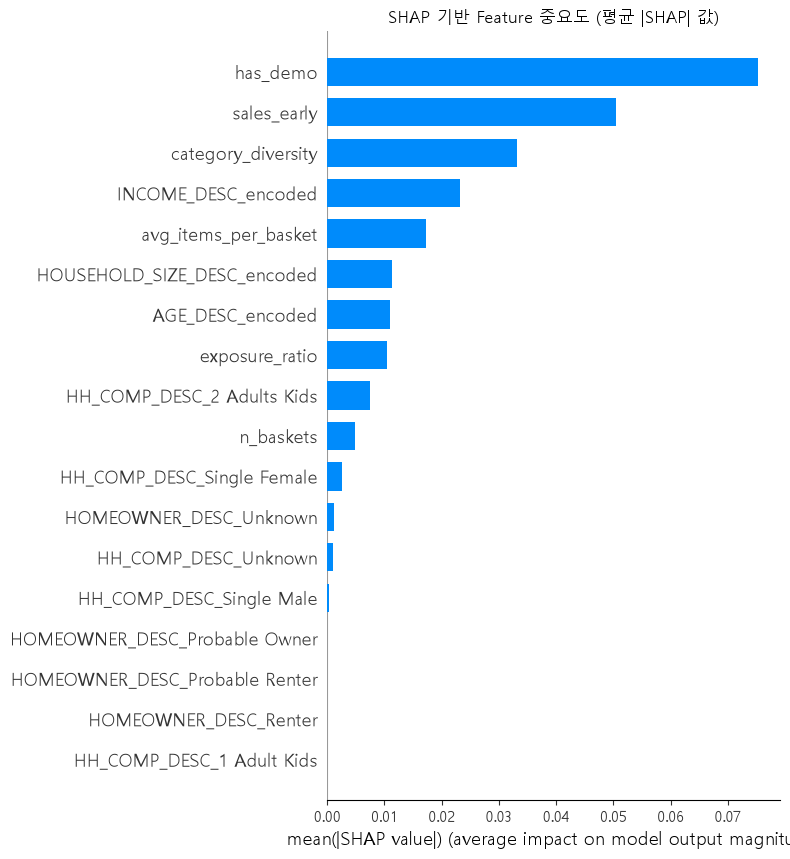
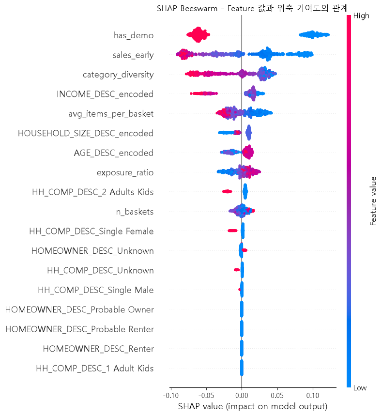

**비선형성 발견**: sales_early, category_diversity 둘 다 "일정 수준을 넘으면 추가 효과가 없다"는 포화(saturation) 구간 확인 — 로지스틱(선형 가정)은 못 잡는 부분. 마케팅 자원을 "이미 충분히 쓰는 고객"이 아니라 "경계선 근처 가구"에 집중해야 함을 시사

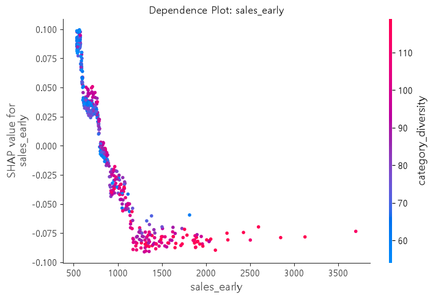
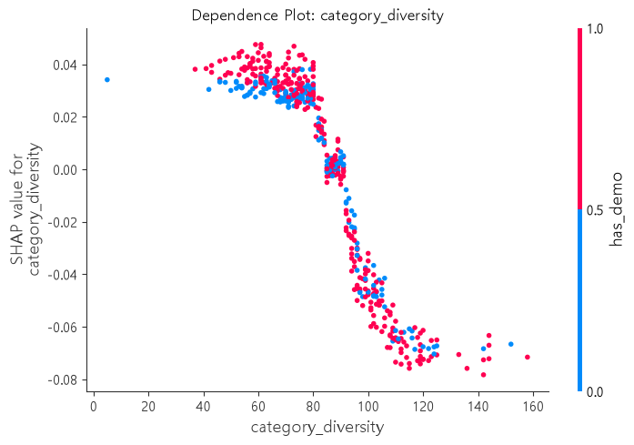

---

### 22. 마케팅 도메인 관점 — FN/FP 비용 비대칭

- **False Negative(실제 위축인데 "유지"로 예측)**: 이탈 중인 우수고객을 놓치는 것 — 통계 검정에서 확인했듯 매출 증가에 큰 영향은 없음. 하지만 좀 더 큰 관점에서 보면 기업은 우수고객이 필요함
- **False Positive(실제 유지인데 "위축"으로 예측)**: 괜찮은 고객에게 리텐션 캠페인 하나 더 보내는 정도 — 마케팅 도메

→ 마케팅 목적상 **Recall(FN 최소화)이 Precision보다 중요**하다는 게 이 도메인의 비용구조에서 뒷받침됨

---

### 23. 모델 검증 — 우연이 아닌가

Permutation test, Dummy classifier 비교, Learning curve 세 가지로 확인한 결과:
- 모델이 학습한 패턴은 통계적으로 확실히 우연이 아니며(p=0.001), 단순 기준선보다 뚜렷하게 나음
- 과적합 흔적 없음 (훈련-검증 성능 격차 거의 없음)
- 다만 learning curve가 아직 완전히 평평해지지 않아, 현재 결과는 "표본에서 뽑아낼 수 있는 최댓값"이라기보다 **"표본이 더 확보되면 개선 여지가 있는 예비적 결과"**로 해석해야 함

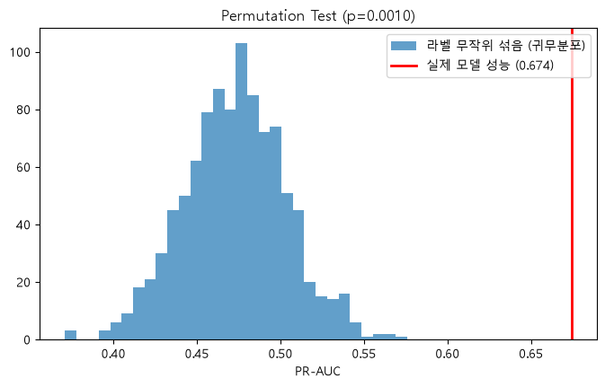
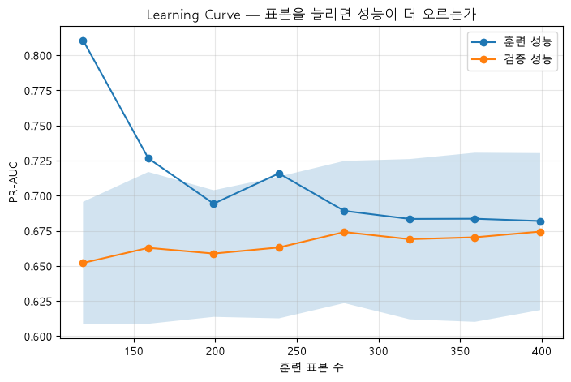

# 캠페인 × 고객계층 이질적 반응 분석

> **"어떤 소비 계층에서, 어떤 캠페인 타입이 지출에 영향을
> 주었는가"**를 검증한 8단계 분석의 전체 기록이다.
>
> 핵심 질문: *"캠페인 기간의 지출 변화가 고객의 평소 지출 수준에 따라 다르게 나타나는지?"*

---

## 0. 분석 설계 원칙

| 원칙 | 이유 |
|---|---|
| 고객 계층은 **17~32주(캠페인 시작 전)**로만 고정 | 33주부터 첫 캠페인이 시작됨. 사후 데이터로 계층을 나누면 "캠페인 → 지출 증가 → 상위계층 분류 → 상위계층 지출 증가 확인"이라는 순환논리가 생김 |
| **가구 고정효과** | 같은 가구를 기준으로, 캠페인 있는 주와 없는 주를 비교. "이 가구는 원래 돈을 많이/적게 쓴다"는 개인별 고정 차이를 제거 |
| **주차 고정효과** | 크리스마스·추수감사절 등 모든 고객에게 공통으로 작용하는 시점 효과를 제거 |
| **가구 단위 클러스터 표준오차** | 84주 반복관측 패널이라 가구 내 자기상관이 있음. 일반 OLS 표준오차는 이를 무시해 p-value를 과소평가함 |
| **3계층(저/중/고)을 본 분석, 5분위를 보조 분석** | 5분위까지 쪼개면 표본이 너무 작아져 계수가 불안정해짐(4단계에서 실제 확인됨) |

---

## 1단계 — 고객 계층 고정 (17~32주)

가구별 17~32주(16주) 평균 주당 지출액으로 계층을 나누고, 이후 어떤 단계에서도 다시 계산하지 않는다.

<!-- 시각화 자리: 가구별 평균 주당 지출액 히스토그램 + 5분위/3계층 컷라인 표시 -->

| 3계층 | 인원수 | 평균 주당지출 | 범위 |
|---|---|---|---|
| 저지출 | 834 | $3.85 | $0.00 ~ $10.03 |
| 중지출 | 834 | $20.36 | $10.05 ~ $33.88 |
| 고지출 | 832 | $72.75 | $33.88 ~ $378.60 |

- 17~32주 거래가 아예 없는 가구 **142개(5.7%)**는 0으로 처리되어 저지출 계층에 자동 편입됨 → 이후 "바닥효과" 리스크로 계속 추적.
- 5분위 최고(93.14) vs 최저(1.61) 격차가 약 58배로, 계층 구분이 통계적으로 의미 있는 수준임을 확인.

---

## 2단계 — 캠페인 타입 × 기간 매핑

`campaign_desc`의 START_DAY/END_DAY를 WEEK_NO로 변환.

<!-- 시각화 자리: 30개 캠페인의 시작~종료 주차를 타입별 색상으로 구분한 간트 차트 -->

| 항목 | 결과 |
|---|---|
| 첫 캠페인 시작 | 33주 (33주 이전 시작 캠페인 0개 — 계층고정/관찰구간 완전 분리 확인) |
| 마지막 캠페인 종료 | 102주 |
| 타입별 캠페인 수 | TypeA=5, TypeB=19, TypeC=6 (H3-B 분석과 독립적으로 일치 — 데이터 무결성 교차확인) |
| 고유 수신 가구 | TypeA=1,513 / TypeB=1,023 / TypeC=397 |
| 캠페인 미수신 가구 | **916명** |
| 2개 이상 타입 수신 가구 | 1,008명 (수신 가구의 63.6%) |

**타입 성격 재해석**: "TypeA=개인화 타겟팅"이라는 라벨과 달리, 전체가구의 60.5%에 도달하고 가구당 평균 2.63회 반복 수신 — **넓은 도달 + 발송 내용만 개인화**로 해석하는 게 정확함.

---

## 3단계 — 가구×주차 패널 구성 (33~101주, 172,500행)

<!-- 시각화 자리: 타입별 활성 가구×주차 조합 수 막대그래프 -->

**핵심 발견 — 동시 노출 문제**: 2개 이상 타입 수신 1,008가구 중 **86.2%(869가구)가 "같은 주"에 동시** 수신 (TypeA+TypeB 3,530건이 최다). → 6단계 회귀 전 VIF 진단 필요성의 근거.

**참고용 단순비교(고정효과 통제 전)**: 저지출 +242%, 중지출 +60%, 고지출 +23% — 이 수치는 이후 6단계에서 **완전히 뒤집힌다** (아래 참고).

---

## 4단계 — Type × 계층 셀 크기 확인

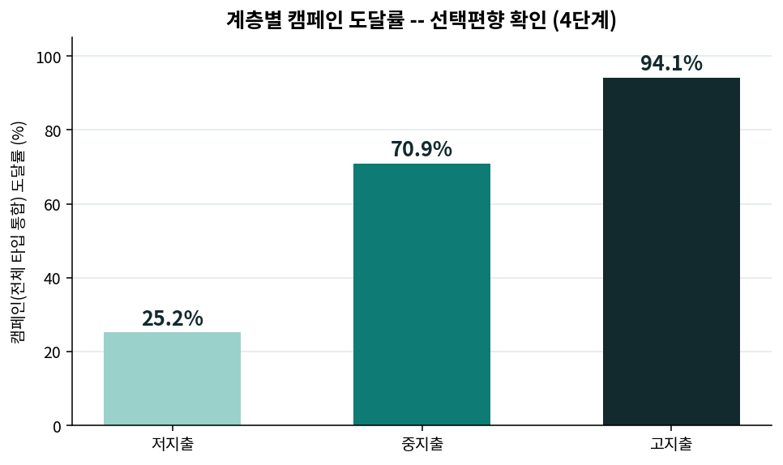

| 계층 | TypeA | TypeB | TypeC |
|---|---|---|---|
| 저지출 | 187 | 90 | **28** ⚠ |
| 중지출 | 554 | 305 | 74 |
| 고지출 | 772 | 628 | 295 |

- 3계층 기준: **저지출×TypeC=28명만** 경계선(기준 30명), 나머지 8개 조합은 안정적.
- 5분위 기준: TypeC의 1분위(16명)·2분위(25명)가 기준 미달 → 3계층 본 분석 설계가 옳았음이 확인됨.
- **도달률(선택편향 확인)**: 저지출 25.2% vs 고지출 94.1% — 캠페인이 원래 고지출 고객에 집중 발송됐음을 실측으로 확인.
- 저지출×TypeC 28명 중 사전지출 0(바닥효과 대상)은 2명(7.1%)뿐 — 이중왜곡 위험은 낮음.

---

## [중간 점검] VIF 다중공선성 진단

<!-- 시각화 자리: Type 활성 더미 간 상관계수 히트맵 -->

| 진단 대상 | VIF 범위 | 판정 |
|---|---|---|
| 원본 Type 활성 더미 3개 | 1.06 ~ 1.09 | 문제없음 |
| Type×계층 상호작용 더미 9개 | 1.02 ~ 1.12 | 문제없음 |

동시노출 비율(86.2%)이 높음에도 VIF가 낮게 나온 이유: 전체 패널(172,500행) 중 동시활성 행은 4.1%뿐이라 압도적 다수(95.9%)가 상관관계를 희석시킴. **6단계 진행 가능 판정.**

---

## 5단계 — 평행추세 사전검정 (17~32주)

캠페인 시작 전, "수신예정 가구군"과 "미수신 가구군"의 추세가 이미 달랐는지 확인.

> **실행 중 발견한 버그**: 그룹별 가구 수를 "거래가 있었던 가구"만으로 세면 142개 바닥효과 가구가
> 분모에서 통째로 빠짐 → 전체 2,500가구 기준으로 수정 후 재실행.

<!-- 시각화 자리: 주차별 가구당 평균 지출 추세선 (수신예정 vs 미수신, 17~32주) -->

| 검정 | 상호작용계수 | p값 | 판정 |
|---|---|---|---|
| 전체 표본 | 0.296 | 0.087 | 5% 통과, 10% 경계선 |
| 저지출 계층 내부 | 0.025 | 0.764 | 안전 |
| 중지출 계층 내부 | 0.308 | **0.053** | 경계선(5% 바로 턱밑) |
| 고지출 계층 내부 | 0.333 | 0.613 | 통과이나 비교군 49명뿐, 검정력 약함 |

**결론**: 완전히 깨끗한 평행추세가 아니다. 저지출 계층만 안전하고, 중지출·전체는 경계선, 고지출은 검정력 자체가 부족해 "통과"의 의미가 약하다.

---

## 6단계 — 본 회귀 (가구·주차 고정효과 + Type×계층 + 클러스터 SE)

`spend ~ Σ(Type×tier3 상호작용 9개) + 가구고정효과 + 주차고정효과`

| 진단 | 결과 | 해석 |
|---|---|---|
| R² (Within) | 0.0004 | 정상 — 캠페인은 주간지출 변동의 극히 일부만 설명(172,500개 관측치라 작은 신호도 검출 가능) |
| F-test for Poolability | 38.138 (p<0.0001) | 가구·주차 고정효과가 반드시 필요했음이 확인됨 |
| F-stat (비클러스터) vs (클러스터) | 11.544(p=0.0000) vs **2.313(p=0.0135)** | 클러스터링 없이는 과대 유의성 — 클러스터 SE 필수였음이 실증됨 |

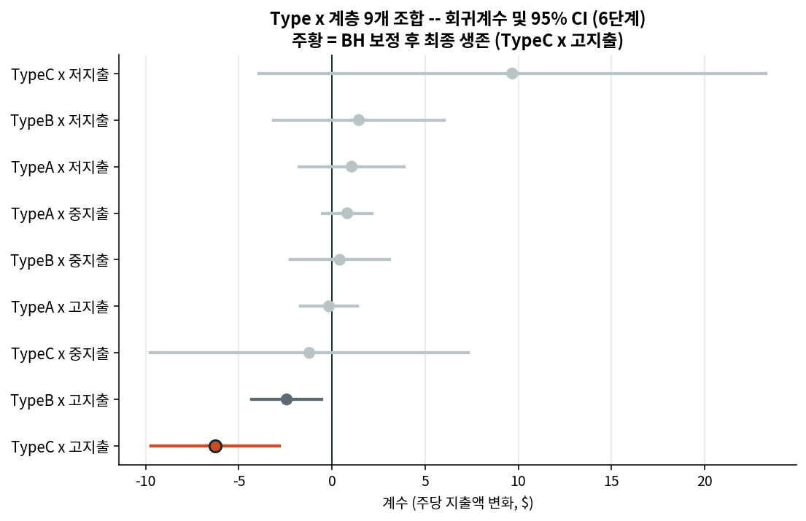

**유의한 조합 (raw p<0.05, 9개 중 2개)**

| 조합 | 계수 | p값 | 표본 | 상대적 크기 |
|---|---|---|---|---|
| TypeC × 고지출 | -6.25 | 0.0004 | 295명 | 평상시 대비 약 -8.6% |
| TypeB × 고지출 | -2.43 | 0.0118 | 628명 | 평상시 대비 약 -3.3% |

방향이 **3단계 단순비교와 정반대**(단순비교는 전 계층 플러스, 본 회귀는 고지출에서 마이너스) — 가구 고정효과가 선택편향을 실제로 제거했다는 증거. 나머지 7개(저지출×TypeC 포함, 계수는 크지만 p=0.163·n=28)는 유의하지 않음.

---

## 7단계 — 다중비교 보정 (Benjamini-Hochberg)

9개를 동시에 검정했으므로 FDR 보정 필요.

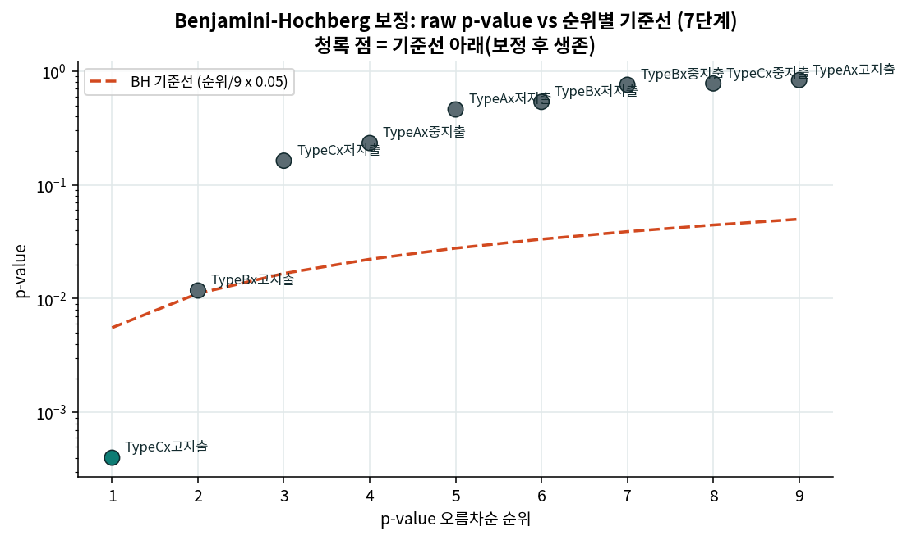

| 순위 | 조합 | raw p | BH 기준선 | p_adj | 통과 |
|---|---|---|---|---|---|
| 1 | TypeC × 고지출 | 0.000371 | 0.00556 | **0.0033** | **통과** |
| 2 | TypeB × 고지출 | 0.011832 | 0.01111 | 0.0532 | 탈락 (근소한 차이) |

**최종 확정: 9개 조합 중 TypeC×고지출 단 1개만 통계적으로 안정적.** TypeB×고지출은 다중비교를 감안하면 "탐색적 신호" 수준으로 하향.

---

## 8단계 — 위약검정 (캠페인 미수신 916가구)

TypeC×고지출 효과가 ①진짜 캠페인 효과인지, ②"이미 지출이 줄던 고지출 고객을 잡으려 캠페인을 몰아 보낸" 역방향 타겟팅의 결과인지 구분하기 위한 검정.

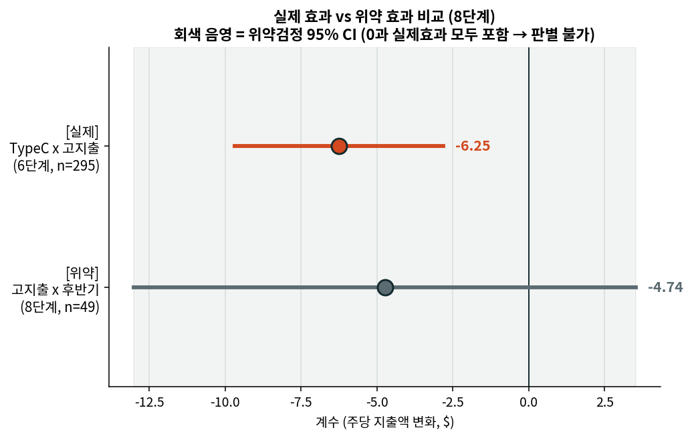

**서술적 비교(33-42주 vs 92-101주 평균)**

| 계층 | 초반 평균 | 후반 평균 | 변화율 |
|---|---|---|---|
| 저지출 | $4.61 | $12.25 | +165.5% |
| 중지출 | $11.27 | $17.33 | +53.8% |
| 고지출 | $43.96 | $43.54 | **-1.0%** |

**회귀 기반(가구·주차 고정효과, 클러스터 SE)**

| 구분 | 계수 | p값 | 95% CI | 표본 |
|---|---|---|---|---|
| [실제] TypeC×고지출 (6단계) | -6.25 | 0.0004 | 대략 (-9.7, -2.8) | 295 |
| [위약] 고지출×후반기 (8단계) | -4.74 | 0.261 | **(-13.00, +3.52)** | **49** |

**판정 — 결론을 내릴 수 없음.** 위약검정의 신뢰구간이 워낙 넓어(비교군 49명) 0도, 실제 효과(-6.25)도, 그 두 배(-13)도 전부 구간 안에 들어간다. 게다가 같은 위약검정을 서술적 방법(-1.0%)과 회귀 기반(-4.74)으로 계산했을 때 결과가 크게 어긋나는데, 이는 **위약검정 자체가 표본 부족으로 불안정하다**는 걸 보여주는 가장 확실한 증거다.

---

## 종합 결론

> **9개의 Type×계층 조합 중 TypeC×고지출 하나만 다중비교 보정 후에도 통계적으로 안정적인
> 연관성을 보였다(계수 -6.25, 평상시 대비 약 -8.6%, BH보정 p=0.0033, 표본 295가구로 안정적).
> 그러나 이 연관성이 캠페인의 효과인지, 원래 지출이 줄어들던 고지출 고객에게 캠페인이 발송된
> 타겟팅의 결과인지는 위약검정으로 가려내지 못했다(비교군 49명, 95% CI가 -13.0~+3.5로 지나치게 넓음). 
> 따라서 이 결과는 "통계적으로 안정적인 연관성"으로만 보고하며,
> 인과관계로 단정하지 않는다.**

**남아있는 두 가설 (데이터로 구분 불가)**

1. TypeC 쿠폰이 "할인 대기 심리"를 유발해 그 주 지출을 실제로 줄인다
2. 회사가 이미 지출이 줄기 시작한 고지출 고객을 잡으려 TypeC를 그 시점에 집중 발송했다 (캠페인이 원인이 아니라 결과)

---

## 데이터 한계

**표본 크기**
- 저지출×TypeC(28명), 고지출 위약 비교군(49명) — 이 프로젝트에서 반복적으로 등장하는 "소표본 불안정성" 패턴이 여기서도 그대로 나타남.

**평행추세 가정**
- 완전히 충족되지 않음. 전체표본·중지출 계층은 경계선(p=0.05~0.09), 고지출 계층은 검정력 부족으로 "통과"의 의미가 약함.

**위약검정의 한계**
- 정확히 결과가 필요한 지점(고지출 계층)에서 비교군이 49명뿐이라 판별력을 상실. "위약검정 통과"로도 "실패"로도 쓸 수 없는 상태.

**이원고정효과(TWFE)의 알려진 함정**
- 30개 캠페인이 33~101주에 걸쳐 시차를 두고 도입되는 구조(staggered adoption)라, 이미 다른 캠페인을 받은 가구가 나중 캠페인의 비교군으로 잘못 쓰이며 추정치가 왜곡될 가능성(Goodman-Bacon 2021 등에서 지적된 문제)이 이론적으로 남아있음. 첫 캠페인만 받은 가구로 한정한 강건성 체크 진행.

**강건성 체크 (최초노출 vs 재노출) 완료**
- TypeC×고지출 효과를 최초노출(n=295, coef=-4.89, p=0.009)과 재노출(n=131, coef=-9.09, p=0.003)로 분리해도 양쪽 모두 유의하게 유지되어, 원 결과가 반복노출 가구의 편중으로 생긴 착시가 아님을 확인했다. 다만 재노출 효과가 최초노출보다 큰 것이 학습효과(반복될수록 할인 대기 심리가 강화됨) 때문인지, 타겟팅 자체가 이미 하락세인 고객에게 반복 집중되는 편향 때문인지는 이번 분석으로 구분하지 못한다.

**캠페인 타겟팅 규칙 미상**
- 회사가 어떤 기준으로 캠페인 대상을 정했는지 알 수 없어, "왜 하필 이 시점에 이 가구가 캠페인을 받았는가"를 데이터만으로는 분석할 수 없음. 이게 8단계 위약검정으로도 못 가려낸 근본 원인.

**관찰자료라는 근본적 한계**
- 가구·주차 고정효과 + 위약검정으로 상당 부분 통제했으나 무작위 실험을 대체하지 않음.

---

## 후속 과제

1. **소규모 무작위 파일럿**: 고지출 고객 중 TypeC 대상군을 무작위로 배정해, 실제 인과효과를 확정
2. **첫 캠페인 한정 강건성 체크**: TWFE 시차도입 문제를 완화하기 위해 이번이 첫 캠페인인 가구만으로 재추정
3. **TypeB×고지출(다중비교 탈락)**: 향후 캠페인 데이터가 누적되면 재검증 대상으로 남겨둘 것
4. **팀 결론 통합 시**: "TypeC=대량발송"이라는 기존 라벨을 "TypeA=넓은 도달+개인화, TypeC=좁고 고지출 편중"으로 재서술 필요