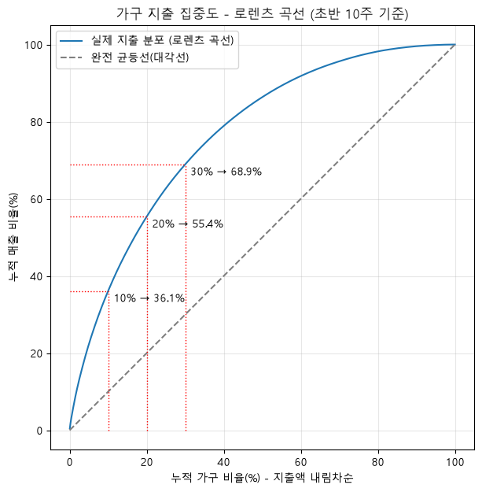
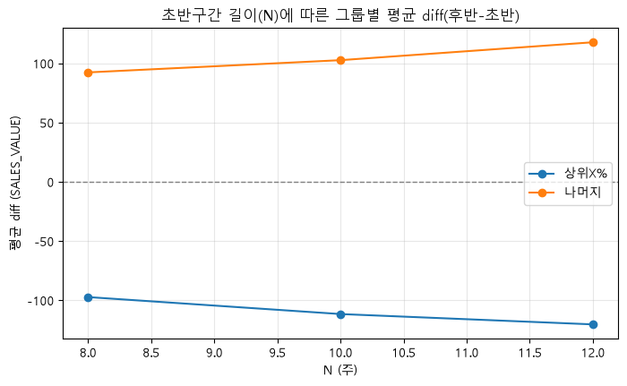

# Dunnhumby - The Complete Journey 리테일 매출 분석

## 프로젝트 개요
Dunnhumby "The Complete Journey" 공개 데이터셋을 기반으로, 안정 관측구간 동안
**총매출이 증가한 원인**을 가설 트리 → 로직 트리 → 통계적 검증 순으로 분해하는 팀 프로젝트.

- 데이터 출처: [Kaggle - Dunnhumby The Complete Journey](https://www.kaggle.com/datasets/frtgnn/dunnhumby-the-complete-journey)
- 분석 프레임워크: 문제정의(가설트리) → 지표지도(AARRR) → 원인분해(로직트리) → 통계검증 → ML → 결론 → 대시보드

## 핵심 발견 (EDA)
- 초반(온보딩 구간)·말미(관측 절단 구간)를 제외한 **안정 구간** 기준으로 총매출은 증가 추세
- `총매출 = 활성 가구 수 × 가구당 방문 빈도 × 방문당 객단가` 로 분해했을 때,
  가구 수·방문 빈도는 안정 구간 내내 평평했고 **객단가만 유일하게 완만히 상승**

## 가설 트리 (H1 ~ H5)
```
전체 기간 총매출이 증가했다
├── H1. 활성 가구 수 자체가 늘었다
├── H2. 가구당 방문(장바구니) 빈도가 늘었다
├── H3-A. 방문당 객단가가 늘었다 — 구매 믹스 변화
├── H3-B. 방문당 객단가가 늘었다 — 가격/할인 변화
├── H4. 매출 증가가 소수 우수고객(상위 지출 가구)의 지출 확대에 집중되어 있다
└── H5. 매출 증가는 특정 시점(계절)에 집중되어 있다
```

## 팀 분업

| 담당 | 가설 | 상태 |
|---|---|---|
| - | H1 (활성 가구 수 / 신규·재활성화 라벨링) | 진행중 |
| - | H2 (방문 빈도 / 캠페인·프로모션 노출) | - |
| - | H3-A, H3-B (구매 믹스 / 가격·할인) | - |
| **본인** | **H4 (우수고객 지출 집중도)** | 방법론 검증 완료, 통계검증(4단계) 진행 예정 |
| - | H5 (계절성 스파이크) | - |

## H4 진행 상황
- **가설**: 매출 증가가 상위 지출 가구(우수고객)에 집중되어 있다
  - H4-1: 안정구간 초반 기준 고정 상위 X% 가구의 매출 비중·절대 지출액이 후반에 늘었다
  - H4-2: 상위 지출군과 신규/재활성화 여부는 연관이 있다
- 로직트리(2×2 완전분해, 사칙연산 검산 가능)로 재구성 완료
- 재활성화 컷오프(gap 기준) 데이터 기반 검토: 통계적 변곡점(~8주) vs 팀 제안(3개월=13주) 트레이드오프 확인
- **TODO**: 4단계(카이제곱·효과크기) 통계검증 → 5단계 로지스틱 회귀(우수고객 조기예측) → 6단계 액션 제안

## 데이터
`data/` 폴더에 Kaggle 원본 8개 CSV 배치 (용량 문제로 저장소에는 미포함, `.gitignore` 처리):


## 노트북
- `dunnhumby_data_overview.ipynb` — 8개 테이블 분포·결측·총매출 추이 확인
- `gap_analysis.ipynb` — 재활성화(win-back) 기준일 탐색용 구매 공백(gap) 분석

## H4. 매출 증가가 소수 우수고객(상위 지출 가구)의 지출 확대에 집중되어 있다

### 하위 가설
- H4-1: 안정구간 초반 기준 고정 상위 X% 가구의 (a)매출 비중과 (b)절대 지출액이 이후 기간에 모두 늘었다
- H4-2: 상위 지출군과 신규/재활성화 여부는 연관이 있다

---

### 1. 방법론 설계 — 순환논리 방지 원칙

"상위 X%"는 반드시 **초반 구간 데이터만으로 고정**한다. 후반 데이터를 섞어서 정의하면
"원래 상위였던 가구가 늘었는지"가 아니라 "늘어난 가구를 상위로 정의한" 것이 되어버려 순환논리가 된다.

"X%" 자체도 관례적인 20%를 바로 쓰지 않고, 실제 지출 집중도 분포(파레토 곡선)를 먼저 확인한 뒤 정하기로 함.

---

### 2. 초반 구간 길이(N주) 결정

**방법**: 가구별 초반 N주 지출액을 홀수주/짝수주로 나눠 각각 순위를 매기고, 두 순위 집합의 Spearman 상관계수를 계산.
N을 늘려가며 상관계수가 어떻게 변하는지 곡선으로 그려 elbow(완만해지는 지점)를 탐지.

**제약 조건**: 안정구간이 17~99주(총 83주)이므로, 초반구간이 전체의 10~15%(약 8~12주)를 넘지 않도록 상한을 둠.

**결과**:

- kneed 기준 elbow: N=10주
- 해당 지점 상관계수: rho=0.697 (중간 정도 — 뚜렷한 elbow는 없었고, 어느 정도 노이즈가 있는 상태에서 X%를 정함)
- 10~15% 규칙(8~12주) 통과 확인

→ **N=10주로 우선 진행**, 추후 8주/12주로 민감도 체크 예정

---

### 3. 상위 X% 결정 — 파레토 곡선(로렌츠 곡선)

초반 10주 기준 가구별 지출액을 내림차순 정렬 → 누적 가구 비율(x) vs 누적 매출 비율(y)로 로렌츠 곡선을 그림.
완전 균등(y=x)이면 가설 자체가 성립하지 않고, 극단적으로 쏠려 있으면 곡선이 초반에 급격히 꺾인다.

**결과**:


- Gini 계수 = 0.532 (0=완전균등, 1=완전독점 — 꽤 집중된 편)
- 관례적 파레토 법칙(20%→80%)과 달리, 이 데이터는 **상위 20%가 매출의 55.4%만 차지** (10%→36.1%, 30%→68.9%) → 파레토보다는 덜 극단적, 상위층이 더 쓰긴 하지만 중간층도 상당한 비중 차지
- 최상위 1%가 전체 매출의 6.1% 차지, 다만 뚜렷하게 꺾이는 지점(elbow)은 없음 — 매끄럽게 감소하는 분포
- kneed 기준 elbow: 상위 18% (관례적 20%와 거의 일치)

→ 데이터 기반 elbow(18%)와 관례적 기준(20%)이 근접 → **X=20%로 확정**

---

### 4. 이상치 처리 방침

IQR 기준으로는 SALES_VALUE의 7.34%가 이상치로 잡혔으나, 이 비율 자체가 "이상치가 많다"가 아니라
"이 분포(오른쪽 꼬리가 긴 지출 데이터)에 IQR 방법이 안 맞는다"는 신호로 해석.
또한 H4는 정확히 "상위 지출 거래"를 보는 가설이라, 이를 제거하면 검증하려는 신호 자체를 지우는 셈이 됨.

→ **이상치를 제거하지 않고, 정규성 가정이 필요 없는 비모수·순위 기반 검정을 사용하는 것으로 대응**

---

### 5. 첫 관찰 — 예상과 반대 방향의 신호 발견

초반/후반 구간 가구별 diff(후반-초반 지출액) 평균을 그룹별로 확인한 결과:
- 나머지80%: +102.74 (증가)
- 상위20%: **-111.49 (감소)**

H4-1이 주장하는 방향("상위 지출가구의 지출이 더 확대됐다")과 **정반대**의 결과.
통계적 착시(회귀효과) 가능성을 배제하기 위해 민감도 체크를 계획보다 앞당겨 진행.

---

### 6. 민감도 체크 (N=8, 10, 12주)



| N(주) | 나머지 평균diff | 상위X% 평균diff |
|---|---|---|
| 8 | +92.42 | -97.16 |
| 10 | +102.74 | -111.49 |
| 12 | +117.85 | -120.21 |

- N을 늘려도 부호가 뒤집히지 않고 오히려 격차가 더 벌어짐 (회귀효과라면 반대여야 함)
- Jaccard 겹침 비율(상위X% 명단의 N간 일치도): 0.76~0.86 — 상위 그룹 구성원 자체가 안정적

→ **통계적 착시가 아니라 진짜 패턴으로 판단.** "초반에 많이 쓰던 가구는 후반에 지출이 줄고, 초반에 덜 쓰던 가구는 늘어나는 **지출 수준의 수렴(convergence) 현상**" 발견

---

### 7. 정규성 · 등분산성 확인

- 정규성: Shapiro-Wilk 검정 → 상위20%, 나머지80% 모두 기각 (비정규)
- 등분산성: Levene 검정 → 기각 (상위20% 분산이 나머지80%보다 3배 이상 큼)

→ **비모수 검정(Wilcoxon 부호순위검정, Mann-Whitney U) 사용 확정**

---

### 8. H4-1 통계적 검증 (본페로니 보정, α=0.05/3≈0.0167)

**검정 A** — 상위20% 가구 자체의 절대 지출액 변화 (Wilcoxon)
- p-value = 0.00002, 효과크기 r = -0.209 (감소 방향)
- 중앙값 diff = -131.45, 95% CI 전부 마이너스 → **유의하게 감소**

**검정 B** — 나머지80% 가구 자체의 절대 지출액 변화 (Wilcoxon, 대조군)
- p-value ≈ 0.0000, 중앙값 diff = +36.49, 95% CI (24.3, 50.1) → **유의하게 증가**

**검정 C** — 두 그룹의 증가폭 차이 (Mann-Whitney U)
- p-value ≈ 0.0000, 효과크기 r = 0.290 (세 검정 중 가장 뚜렷한 효과)
- 공통언어효과크기 = 0.355 (완전 무작위면 0.5여야 함 — 나머지80%가 상위20%보다 더 늘어난 경우가 훨씬 흔함)
- 95% CI (-227.7, -116.0), 0 미포함 → **그룹 간 차이 유의**


세 검정 모두 유의, 방향도 일관(상위 감소·나머지 증가) → **H4-1(금액 관점) 기각**

**검정 D** — 상위20%의 매출 비중(share) 변화 (부트스트랩 5,000회)
- 가구별 값이 아니라 시점당 비중 값 1개씩이라 순위 기반 검정 불가 → 복원추출 재표본화로 95% CI 직접 산출
- 초반 비중 54.87% → 후반 비중 41.96% (**-12.91%p**)
- 95% CI (-14.74%p, -11.09%p), 0 미포함 → **비중도 유의하게 감소**


---

### 9. H4-1 최종 결론

금액(절대액)과 비중 두 관점 모두에서 상위20%의 위축이 확인됨 — **H4-1 원 가설 기각**.
대신 "상위-하위 고객 간 지출 격차가 좁혀지는 **탈집중화(수렴) 현상**"이 통계적으로 뒷받침됨.
상위 지출가구의 이탈/둔화 신호일 수도, 중하위 고객군의 성장일 수도 있어 추가 확인 필요.

---

### 10. H4-2 착수 — 신규/재활성화 정의 확정 및 2×2 교차표 설계

H4-1로 매출 증가를 실제로 견인한 게 나머지80%임이 확인됨에 따라, 이 성장이 (1)기존 활성가구의 자연 성장인지
(2)신규·재활성화 가구 유입인지를 확인하기 위해 H4-2 진행.

**라벨 정의**
- 신규: 전체 관측기간 중 첫 구매일이 안정구간 시작(week 17) 이후인 가구
- 재활성화: 신규가 아니면서 구매 공백이 13주(91일) 이상이었던 적이 있는 가구
- 기존: 위 두 조건에 모두 해당하지 않는 가구

2×2 교차표(상위20%/나머지80% × 신규·재활성화/기존) 구성 완료, 결과 해석은 다음 회의에서 진행 예정.